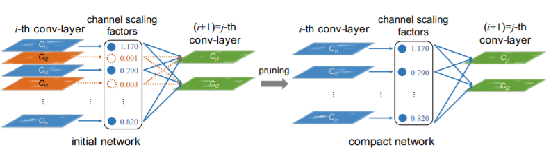
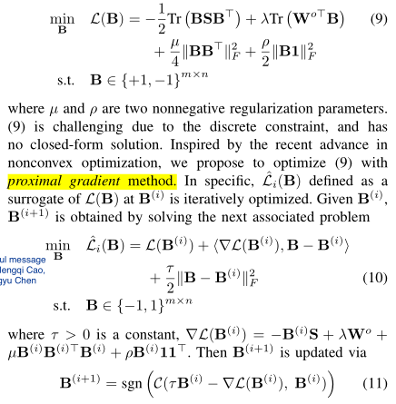

# Network Slimming Architecture

#### Objective function

$$
L=\sum_{(x,y)}l(f(x,W),y)+\lambda\sum_{\gamma}g(\gamma)
$$

> 惩罚项 g(·) 是L1范数
> 
> Subgradient descent is adopted as the optimization method for the nonsmooth L1 penalty term. An alternative option is to replace the L1 penalty with the smooth-L1 penalty to avoid using sub-gradient at non-smooth point.
> 
> **smooth-L1**: M. Schmidt, G. Fung, and R. Rosales. Fast optimization methods for l1 regularization: A comparative study and two new approaches. In ECML, pages 286–297, 2007.
> 
> 为什么L1范数会使权值稀疏？有人可能会这样回答“它是L0范数的最优凸近似”。

# 与NS不同：我们的$\gamma$是二值的

Our contribution:

- 提出一种边训边减的蒸馏方法 【主任务】

- 是一种binary network embedding，用与原网络参数同时训练得到的 "gate"参数表征一个有冗余的网络。

- Filter-level Dropout

# PGD

- 近端梯度法（PGD）是一种特殊的梯度下降方法，主要用于求解目标函数不可微的最优化问题。如果目标函数在某些点是不可微的，那么该点的梯度无法求解，传统的梯度下降法也就无法使用。PGD 算法的思想是，使用临近算子作为近似梯度，进行梯度下降。

- Tutorial: [CSDN博客介绍PG方法](https://blog.csdn.net/qq_38290475/article/details/81052206)

- Handbook1: [Proximal Gradient Descent for L1 Regularization](https://breezedeus.github.io/2013/11/16/breezedeus-proximal-gd.html)

- Handbook2: [近端梯度法流程](https://blog.csdn.net/jzwong/article/details/80329470)

- TensorFlow PGD optimizer source code: [tensorflow-definition](https://www.tensorflow.org/api_docs/python/tf/train/ProximalGradientDescentOptimizer#compute_gradients)

- 在参考论文中，作者的更新方法为（有公式但没有详细推导）：

