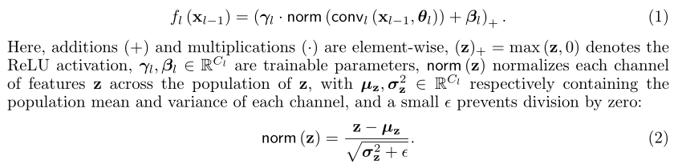
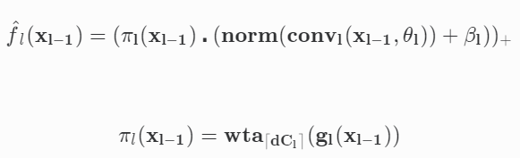
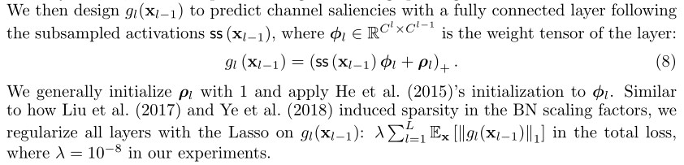
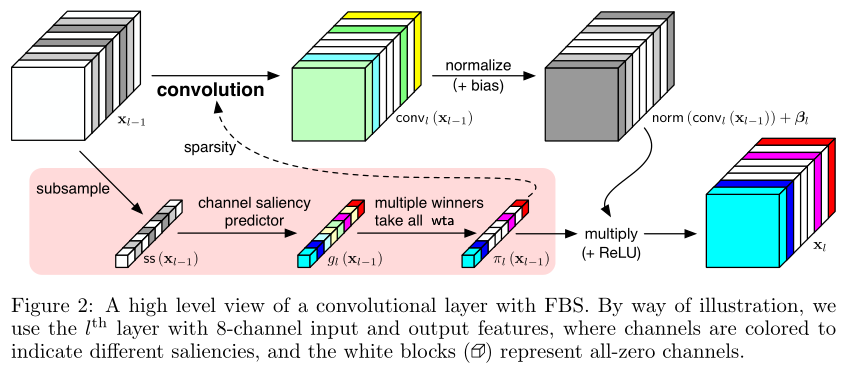
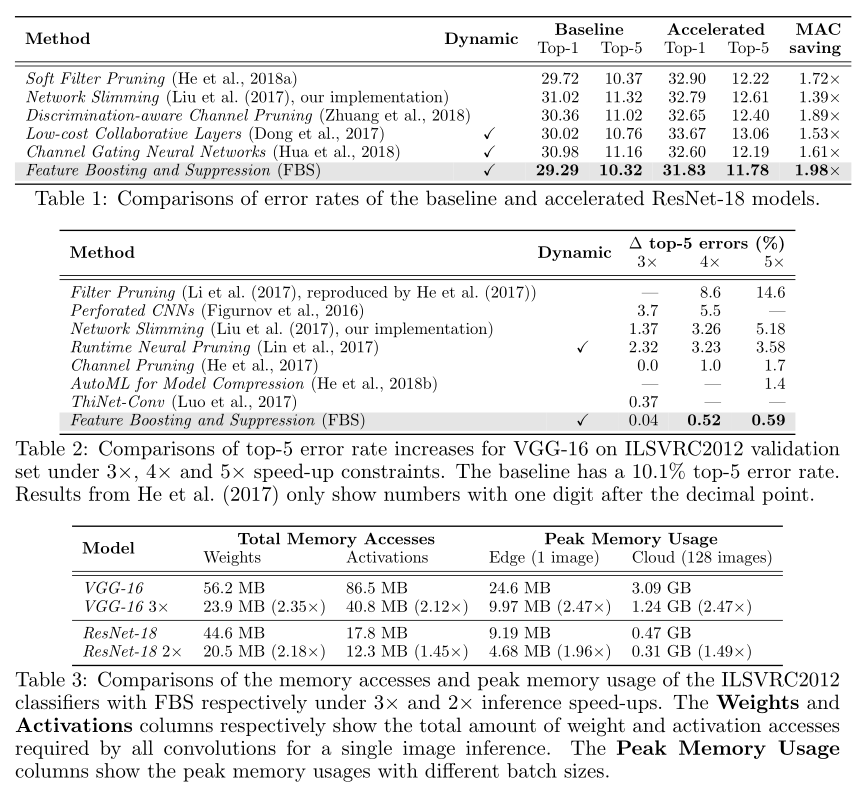

# Info

> @article{DBLP:journals/corr/abs-1810-05331,
>   author    = {Xitong Gao and
>                Yiren Zhao and
>                Lukasz Dudziak and
>                Robert Mullins and
>                Cheng{-}Zhong Xu},
>   title     = {Dynamic Channel Pruning: Feature Boosting and Suppression},
>   journal   = {CoRR},
>   volume    = {abs/1810.05331},
>   year      = {2018},
>   url       = {http://arxiv.org/abs/1810.05331},
>   archivePrefix = {arXiv},
>   eprint    = {1810.05331},
>   timestamp = {Tue, 04 Dec 2018 10:06:41 +0100},
>   biburl    = {https://dblp.org/rec/bib/journals/corr/abs-1810-05331},
>   bibsource = {dblp computer science bibliography, https://dblp.org}
> }
> 
> 一作来自Shenzhen Institutes of Advanced Technology, Shenzhen, China
> 
> 其他都是University of Cambridge, Cambridge, UK
> 
> ICLR 2019，github地址：https://github.com/deep-fry/mayo/blob/master/docs/fbs.md

# 作者讲的故事

> why should we prune by static importance, if the importance is highly input-dependent? Instead of simply reducing model size at the cost of accuracy with pruning, we can accelerate convolution by selectively computing only a subset of channels predicted to be important at run-time, while considering the sparse input from the preceding convolution layer.

也就是说：In contrast to channel pruning methods which permanently remove channels, it preserves the full network structures and accelerates convolution by dynamically skipping unimportant input and output channels.

> Intuitively, we can imagine that the flow of information of each output channel can be amplified or restricted under the control of a “valve”*(n. 阀门)*. Unlike pruning statically, the valves use features from the previous layer to predict the saliency of output channels.

这里作者提出了用强化学习做动态剪枝的不足，并且DISS了《Runtime Neral Pruning》：Existing dynamic computation strategies in CNNs (Lin et al., 2017; Odena et al., 2017; Bolukbasi et al., 2017) produce on/off pruning decisions or execution path selections. Training them thus often resorts to reinforcement learning, which in practice is often computationally expensive. The on/off decisions commonly used in these networks cannot be represented by differentiable functions, hence the gradients are not well-defined. Consequently, the dynamic networks above train their policy functions by reinforcement learning.

# 同行评议

Pros:

- The results on ImageNet are promising. FBS achieves state-of-the-art results on VGG-16 and ResNet-18.
- The method is simple yet effective.
- The paper is clear and easy to follow.

Cons:

- Lack of experiments on mobile networks like shufflenets and mobilenets
- Missing citations of some state-of-the-art methods.
  - Amc: Automl for model compression and acceleration on mobile devices 
  - Netadapt: Platform-aware neural network adaptation for mobile applications
- The speed-up ratios on GPU or CPU are not demonstrated. The dynamic design of Dong et al., 2017 did not achieve good GPU speedup.
- Some small typos.

# Contribution: 提出了FBS------结构化(Structual)动态(Dynamic)剪枝算法

广义的剪枝可以用公式表示为：

$$
\hat{f}(\bf{x},...)=f(\bf{x},\bf{\theta},...)\bigodot\pi(\bf{x},\bf{\phi},...)
$$

通过对$\pi$函数的设计，可以保留原有的网络结构，只训练必要的critical routing path

考虑到带BN层的CNN：

- $C_l$ channels of features with height $H_l$ and width $W_l$ .

- weight tensor $θ_l ∈ R^{C_l×C_{l−1}×k^2}$ , where k is the kernel size.

- A CNN spends the majority of its inference time, using $k^2*C_{l−1}*C_l*H_l*W_l$ multiply-accumulate operations (MACs) for the l th layer.

- network slimming就是用$\bf{\beta}$作为衡量channel重要性的指标

### 作者提出的方法是：

$wta_k(\bf{z})$: k-winners-take-all function

> returns a tensor identical to z, except that we zero out entries in z that are smaller than the k largest entries in absolute magnitude.
> 
> computes only $\lceil dC_l \rceil$ most salient channels predicted by $g_{l}(x_{l−1})$, and suppresses the remaining channels with zeros
> 
> d是超参数, varied to sweep the trade-off between performance and accuracy

$$
g_l(x_{l-1})=(ss(x_{l-1})\phi_l+\rho_l)_+
$$

$$
ss(x_{l-1})=\frac{1}{HW}[s(x_{l-1}^{[1]})s(x_{l-1}^{[2]})...s(x_{l-1}^{[C]})]
$$

- $s(x_{l-1}^{[1]})$reduces the $c_{th}$ channel to a scalar，在实验中$s() = L_1范数$

算法设计如图：

# Experiments

Because all convolutions can exploit both input- and output-side sparsity, the speed-up gained from pruning is quadratic with respect to the pruning ratio. For instance, dynamically pruning half of the channels in all layers gives rise to a dynamic CNN that uses approximately $\frac{1}{4}$ of the original MACs.

Our method begins by first replacing all convolutional layer computations with 

$$
\hat{f}_l(\bf{x}_{l-1})=(\pi_l(\bf{x}_{l-1})(norm(conv_l(\bf{x}_{l-1},\bf{\theta}_l))+\beta_l))_{+}
$$

, and initializing the new convolutional kernels with previous parameters. 

Initially, we do not suppress any channel computations by using density d = 1 in 

$$
\pi_l(\bf{x}_{l-1})=wta_{\lceil dC_l \rceil}(g_l(\bf{x}_{l-1}))
$$

and fine-tune the resulting network. 

For fair comparison against NS, we then follow Liu et al. (2017, network slimming) by iteratively decrementing the overall density d of the network by 10% in each step, and thus gradually using fewer channels to sweep the accuracy/performance trade-off. The difference is that NetworkSlimming prunes channels by ranking globally, while FBS prunes around $1 − d$ of each layer.

实验结果惊人：
