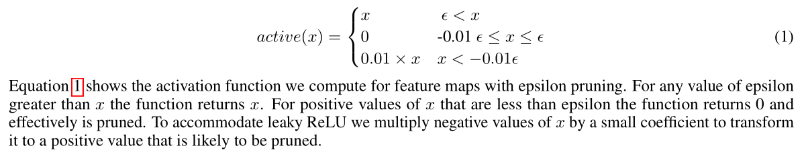
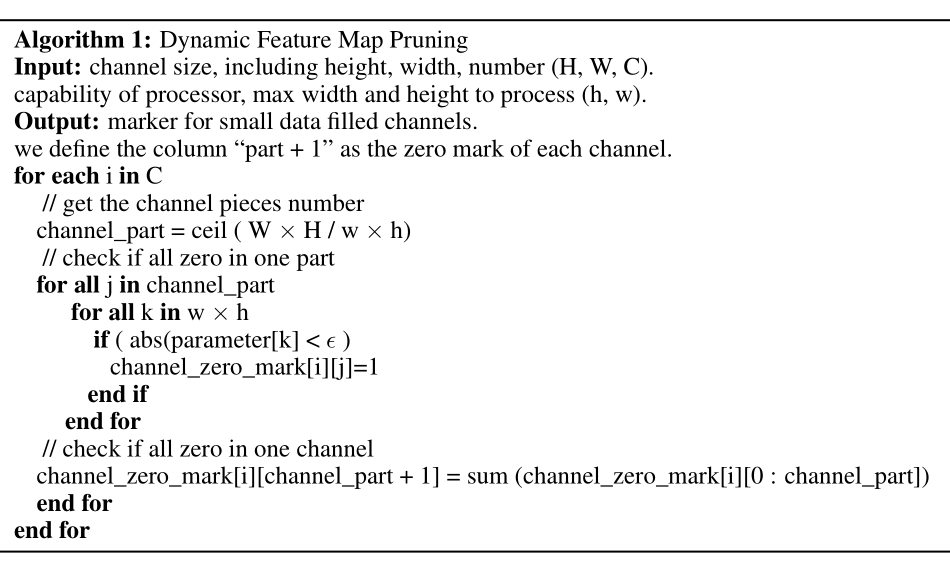

# Info

> @article{DBLP:journals/corr/abs-1812-09922,
>   author    = {Tailin Liang and
>                Lei Wang and
>                Shaobo Shi and
>                John Glossner},
>   title     = {Dynamic Runtime Feature Map Pruning},
>   journal   = {CoRR},
>   volume    = {abs/1812.09922},
>   year      = {2018},
>   url       = {http://arxiv.org/abs/1812.09922},
>   archivePrefix = {arXiv},
>   eprint    = {1812.09922},
>   timestamp = {Wed, 02 Jan 2019 14:40:18 +0100},
>   biburl    = {https://dblp.org/rec/bib/journals/corr/abs-1812-09922},
>   bibsource = {dblp computer science bibliography, https://dblp.org}
> }

# Abstract

Networks using ReLU (AlexNet, SqueezeNet, VGG16) contain a high percentage of 0-valued parameters and can be statically pruned. Networks with Non-ReLU activation functions in some cases may not contain any 0-valued parameters (ResNet-50, TinyNet).

We also investigate runtime feature map usage and find that input feature maps comprise the majority of bandwidth requirements when depth-wise convolution and point-wise convolutions used.

We introduce **dynamic runtime pruning of feature maps and show that 10% of dynamic feature map execution can be removed without loss of accuracy**. We then **extend dynamic pruning to allow for values within an $\epsilon$ of zero and show a further 5% reduction of feature map** loading with a 1% loss of accuracy in top-1.

# Related Works

One possible implementation of dynamic runtime pruning considers any parameters that are trained as 0-values are implemented within a processing element (PE) in such a way that the PE is inhibited from participating in the computation

>  这里引用了runtime neural pruning那篇文章，但是作者并没有比较自己的工作与这篇论文。

### 动态剪枝主要有两种方法kernel-level & channel-level，下面列举了相关工作

A kernel map comes from pre-trained coefficient matrices stored in external memory. These are usually saved as a weights file. The kernel is a filter that has the ability to identify input data features. Most dynamic runtime pruning approaches remove kernels of computation\[ 6, 10, 11\]. In this approach, loading bandwidth is reduced by suppressing the loading of weights.

> 6 ------  Song Han, Huizi Mao, and William J. Dally. Deep Compression: Compressing Deep Neural Networks with Pruning, Trained Quantization and Huffman Coding. arXiv preprint arXiv:1510.00149, 45(4):199–203, 10 2015.
> 
> 10 ------  Song Han, Jeff Pool, John Tran, and William J. Dally. Learning both Weights and Connections for Efficient Neural Networks. Lancet (London, England), 346(8988):1500, 6 2015.
> 
> 11 ------  Y. LeCun, B. Boser, J. S. Denker, D. Henderson, R. E. Howard, W. Hubbard, and L. D. Jackel. BackpropagationApplied to Handwritten Zip Code Recognition. Neural Computation, 1(4):541–551, 12 1989.

Another approach for convolutional neural networks is to dynamically remove feature maps (sometimes called filter "channels"). In this approach channels that are not participating in the classification determination are removed at runtime. This type of dynamic runtime pruning is the focus of this paper. 

(但是作者这里并没有引用别人的工作)

# Algorithm & Experiment

### github url:  [here](https://github.com/liangtailin/darknet-modified)

作者提出了新的activation function，跟超参数$\epsilon$有关。

算法如下图，暴力搜索参数为零的feature map：

算法说明：

1. If we determine that a feature map has 0-valued coefficients such that the entire channel is unused, we mark it and subsequently do not compute any values for that feature map. Specifically, we count the number of zeros ( or absolute value less than $\epsilon$ ). If the entire channel is filled with values less than $\epsilon$, we then regard this channel as a zero channel and mark it for later identification. When loading a feature map for processing, if the channel was marked to be within an $\epsilon$ of 0, we will prune it. 

2. Some implementations may not implement sufficient neurons (multiply-accumulate units) to process an entire feature map simultaneously. In this case **we can break the feature map into smaller pieces. We then sum the flag of each part to determine if the entire feature map is filled with $\epsilon$ zero elements.** If so, the entire feature map will be marked as zero-filled and will be skipped thus saving feature map loading and reducing bandwidth requirements. 

# 谁引用了这篇文章

谷歌学术甚至还没有它的词条，所以暂且不表。

# 我的观点

作者关注的是0-valued/$\epsilon$-value feature map，这个假设太强了，如果nonzero-valued channel也可以被某种标准剪掉，这样可以将剪枝率调整到比他们还高，那就是我们的优势。
