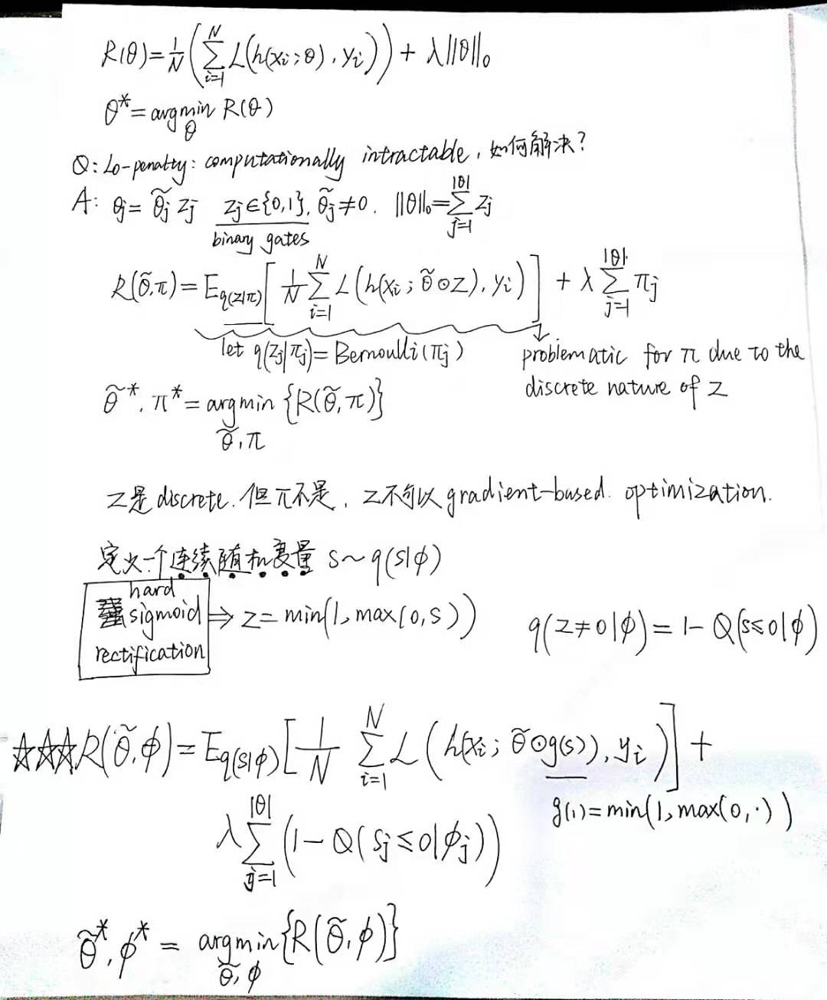
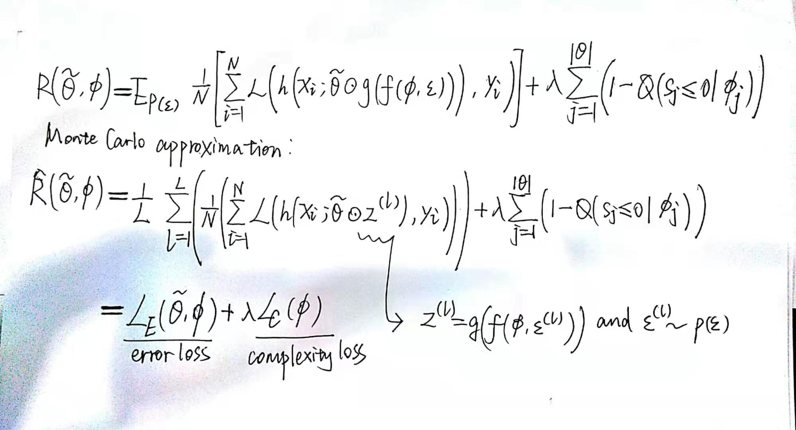

### Learning Sparse Neural Networks through $L_0$ Regularization

作者：Christos Louizos

机构：University of Amsterdam TNO, Intelligent Imaging & OpenAI

项目地址：[HERE](https://github.com/AMLab-Amsterdam/L0_regularization)

主要贡献：propose a practical method for $L_0$ norm regularization for neural networks: **pruning the network during training** by encouraging weights to become exactly zero.

观点整理：

- $L_0$范数是指向量中非0的元素的个数；

- $L_0$ norm induces no shrinkage on the actual values of the parameters θ ; this is in contrast to e.g. $L_1$ regularization and the Lasso , where the sparsity is due to shrinking the actual values of θ；

- While the $L_0$ norm leads to sparse estimates without imposing any shrinkage on $\theta$ it might still be desirable to impose some form of prior assumptions on the values of $\theta$ with alternative norms, e.g. impose smoothness with the $L_2$ norm (i.e. weight decay)

 

for continuous distributions $q(s)$ that allow for the reparameterization trick, we can express the objective function as an expectation over a parameter free noise distribution $p(\epsilon)$ and a deterministic and differentiable transformation $f(·)$ of the parameters $\phi$ and $\epsilon$ :

该论文难懂的地方在于如何用monte carlo approximation生成连续随机变量s，从而近似bernoulli分布的离散变量z：下文中作者写到：The parameters of the distribution are $\phi = (log\alpha,\beta)$ , where $log\alpha$ is the location and $\beta$ is the temperature. 

再后面就没有看了，太他娘的硬核了全是数学表达式。
