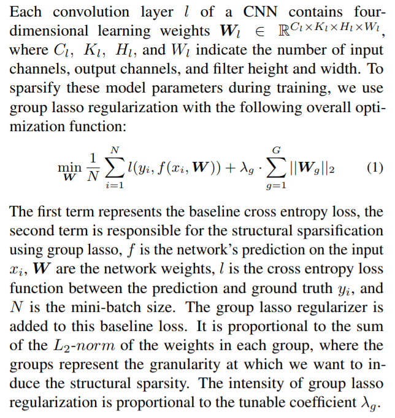
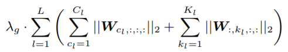
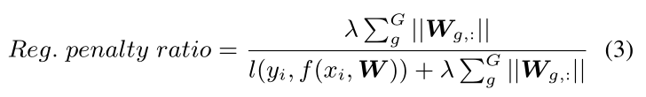

# Info

> @article{DBLP:journals/corr/abs-1901-09290,
>   author    = {Sangkug Lym and
>                Esha Choukse and
>                Siavash Zangeneh and
>                Wei Wen and
>                Mattan Erez and
>                Sujay Shanghavi},
>   title     = {PruneTrain: Gradual Structured Pruning from Scratch for Faster Neural
>                Network Training},
>   journal   = {CoRR},
>   volume    = {abs/1901.09290},
>   year      = {2019},
>   url       = {http://arxiv.org/abs/1901.09290},
>   archivePrefix = {arXiv},
>   eprint    = {1901.09290},
>   timestamp = {Sat, 02 Feb 2019 16:56:00 +0100},
>   biburl    = {https://dblp.org/rec/bib/journals/corr/abs-1901-09290},
>   bibsource = {dblp computer science bibliography, https://dblp.org}
> }

# Abstarct

Model pruning is a popular mechanism to make a network more efficient for inference. In this paper, we explore the use of pruning to also make the training of such neural networks more efficient. Unlike all prior model pruning methods that sparsify a pre-trained model and then prune it, we train the network from scratch, while gradually and structurally pruning parameters during the training. **We build on our key observations: 1) once parameters are sparsified via regularization, they rarely re-appear in later steps, and 2) setting the appropriate regularization penalty at the beginning of training effectively converges the loss**. We train ResNet and VGG networks on CIFAR10/100 and ImageNet datasets from scratch, and achieve 30-50% improvement in training FLOPs and 20-30% improvement in measured training time on modern GPUs.

# Conclusion

作者的观点是：预训练模型增加参数量和训练时间（因为往往要fine-tune）

> Prior pruning approaches start with a pre-trained dense network model and proceed to zero out parameters using trial-and-error or group-lasso regularization learning (Li et al., 2016; Molchanov et al., 2016; Wen et al., 2016; He et al., 2017). This process involves many complete training rounds and includes additional hyper parameters. This significantly increases the overall training time compared to a dense model, which is made even worse by fine-tuning training rounds after pruning is complete.

作者提出的PruneTrain算法的核心在于：group-lasso at the beginning

``Details of group-lasso: http://myweb.uiowa.edu/pbreheny/7600/s16/notes/4-27.pdf``

> We apply group lasso regularization from the beginning including to the untrained model and set the lasso penalty to constrain the regularization loss to a small portion of the total loss. This reduces the weights of regularized channel parameters to near zero with minimal impact on accuracy.

实验的Metrics有两个: the FLOPs reduced and the actual measured end-to-end training time on a GPU

在PruneTrain基础上又进一步针对CNN进行优化，原文：          ``这里没看懂``

> We propose channel union, a practical sparse network reconfiguration method for CNNs with short-cut connections. Channel union removes the tensor reshaping overhead, leading to training and inference speedups on GPU accelerators.

# Methodology

对于正则化项，做了reformulate：

$\lambda_g可以表示为：$

# 如何剪枝？

We define a **reconfiguration interval**, such that after every such interval, the sparsified input and output channels are pruned out. To maintain dimension consistency, we **only prune the intersection of the sparsified channels of any two adjacent layers**.

Intuitively, a very short reconfiguration interval may degrade learning quality while a long interval offers less speedup opportunity.

有针对ResNet对算法进行修改，暂时还不需要考虑。
