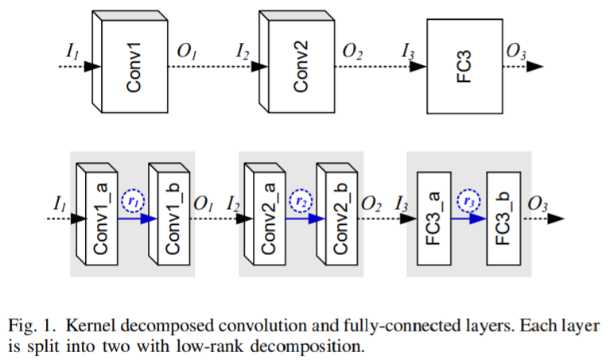

# 通过全部和动态过滤器剪枝加速卷积网络（Accelerating Convolutional Networks via Global & Dynamic Filter Pruning）

厦门大学，腾讯优图，IJCAI 2018，[机器之心整理](https://zhuanlan.zhihu.com/p/39568728)

提出了一种基于每个过滤器的预先知识的全局判别函数，让 GDP 成了*首个在所有层上全局地剪枝不显著过滤器的方法。*另外，它还能在整个剪枝后的稀疏网络上动态地更新过滤器的显著性（预训练网络，masked filter，全局函数set mask），然后恢复被错误剪枝的过滤器，之后再通过一个再训练阶段来提升模型准确度，但是并不是state-of-the-art的网络加速方法。

# PCNN: Environment Adaptive Model Without Finetuning

ICLR 2019 • Boyuan Feng • Kun Wan • Shu Yang • Yufei Ding

我们的VGG16预训练模型就是Boyuan Feng的这就很骚了

为了将网络部署在mobile device上，一种方法是传统的tradeoff-between-accuracy-computation，另一种最近被提出的方法是class skew（the strong temporal and spatial locality of the appearance of classes）

对于class skew，传统的方法是迁移学习，不适合“部署移动端”的场景。

In this paper, we propose probability layer, an easily-implemented and highly flexible *add-on module to adapt the model efficiently during runtime* without any fine-tuning and achieving an equivalent or better performance than transfer learning. Further, both increasing accuracy and decreasing resource consumption can be achieved during runtime through the combination of probability layer and pruning methods.

然后被Area Chair直接否了，有一个Reviewer直接评价 “ The paper lacks novelty and at the same time, it is not quite compensating that with a detailed analysis of the work. The problem is interesting and I like the work because the approach is simple and the results look good. I think with a stronger focus on more detailed analysis, this can be a good submission to an applied conference like MobiCom etc. ”

# A Framework for Fast and Efficient Neural Network Compression

KAIST, Hyeji Kim, Muhammad Umar Karim, and Chong-Min Kyung

> 关于kernel-level pruning，讲了个有趣的故事

Kernel decomposition with singular value decomposition (SVD) automatically assigns importance (the singular values) to the decomposed kernels. This automatic sorting makes filter pruning easier, as the decomposed kernels with the lower parameters are the first to be pruned. With kernel decomposition schemes, the problem boils down to **the choice of the right rank for each layer of the network**. In other words, we need to find the rank configuration for the whole network that satisfies constraints on speed, memory and accuracy.  目前的工作都是提出iterative search for the right rank configuration的算法代价太大，作者提出的ENC算法既是non-iterative又是outperform其他工作的。

| Method based on ENC (proposed by the authors) | Description                                                                                                |
| --------------------------------------------- | ---------------------------------------------------------------------------------------------------------- |
| ENC-Map                                       | uses a mapping function to obtain the right rank configuration from the given constraint on complexity     |
| ENC-Model                                     | uses a metric representative of the accuracy of the whole network to find the right rank configuration.    |
| ENC-Inf                                       | uses both the accuracy model and inference on a partial dataset to arrive at the right rank configuration. |

# Layer-compensated Pruning for Resource-constrained Convolutional Neural Networks

Ting-Wu Chin, Cha Zhang, Diana Marculescu, CMU

也是需要预训练的，所以没有仔细看。

**Resource-constrained CNN** problem has been recently approached from two directions: (i) resource-constrained neural architecture search（自底向上） and (ii) resource-constrained model compression（也就是剪枝，自顶向下）。

结构化剪枝的两个问题：

- deciding which filter to disable such that accuracy is maximized and constraints are satisfied is a NP-hard combinatorial problem

- deep neural networks are highly non-linear functions that are hard to analyze

指向了两种研究方向：

- which filters to prune, given a per-layer pruning budget （**ranking problem**）

- how many filters to prune for each layer, （**layer scheduling problem**）

ranking好多人在做但是layer scheduling少有人做。

> He, Y., Lin, J., Liu, Z., Wang, H., Li, L.-J., and Han, S. Amc: Automl for model compression and acceleration on mobile devices. arXiv preprint arXiv:1802.03494, 2018b.
> 
> CONTRIBUTION: reinforcement learning to learn an agent for deciding how many filters to prune for each layer given a resource constraint. （第一次讨论layer scheduling问题，工作的问题在于time-consuming）

四大贡献：

- We define the pruning problem from a theoretical standpoint and connect to prior solutions throughout the derivations.

- We propose a novel, effective, and efficient algorithm, dubbed layer-compensated pruning, which improves prior art by learning to compensate for the approximation error incurred in the derivation in a layer-wise fashion. Specifically, we achieve slight better results 8x faster.

- In our general formulation, we show that layercompensated pruning can improve various commonlyadopted heuristic metrics such as $l_1,l_2$ of weights, and 1st-order Taylor approximation.

- We conduct comprehensive analysis to justify our findings on already-small deep neural networks, i.e., ResNet and MobileNetV2, using three datasets, i.e., CIFAR-10, ImageNet, and Bird-200.

# Runtime Neural Pruning

由于是17年的老成果而且很多人在引用，所以就没有看，只复制粘贴了abstract。

In this paper, we propose a Runtime Neural Pruning (RNP) framework which prunes the deep neural network dynamically at the runtime. Unlike existing neural pruning methods which produce a fixed pruned model for deployment, our method preserves the full ability of the original network and conducts pruning according to the input image and current feature maps adaptively. **The pruning is performed in a bottom-up, layer-by-layer manner, which we model as a Markov decision process and use reinforcement learning for training. The agent judges the importance of each convolutional kernel and conducts channel-wise pruning conditioned on different samples, where the network is pruned more when the image is easier for the task.** Since the ability of network is fully preserved, the balance point is easily adjustable according to the available resources. Our method can be applied to off-the-shelf network structures and reach a better tradeoff between speed and accuracy, especially with a large pruning rate.

# Dynamic Runtime Feature Map Pruning（笔记见仓库）

# Dynamic Channel Pruning Feature Boosting and Suppression（笔记见仓库，这篇文章是真的有东西，他们怕是已经完成我们的工作了）
