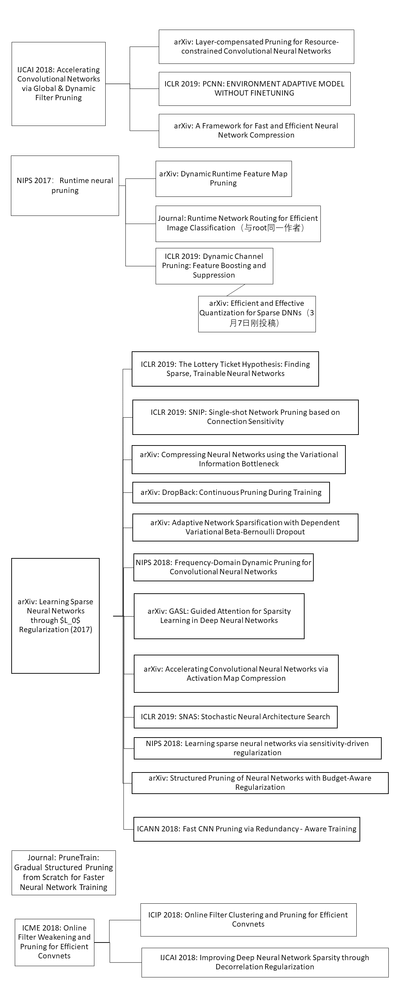

# 这里总结了PPT中所有论文的Abstract

| Title                                                                             | Abstract                                                                                                                                                                                                                                                                                                                                                                                                                                                                                                                                                                                                                                                                                                                                                                                                                                                                                                                                                                                                                                                                                                                                                                                                                                                                                                                                                                                                                                                                                                                                |
| --------------------------------------------------------------------------------- | --------------------------------------------------------------------------------------------------------------------------------------------------------------------------------------------------------------------------------------------------------------------------------------------------------------------------------------------------------------------------------------------------------------------------------------------------------------------------------------------------------------------------------------------------------------------------------------------------------------------------------------------------------------------------------------------------------------------------------------------------------------------------------------------------------------------------------------------------------------------------------------------------------------------------------------------------------------------------------------------------------------------------------------------------------------------------------------------------------------------------------------------------------------------------------------------------------------------------------------------------------------------------------------------------------------------------------------------------------------------------------------------------------------------------------------------------------------------------------------------------------------------------------------- |
| Online Filter Weakening and Pruning for Efficient Convnets                        | Pruning is an effective method to address the limitation of deploying deep neural networks (DNNs) on embedded systems. Most existing methods prune weights on a given pre-trained DNN followed by a costly fine-tuning process. In this paper, we propose a new and efficient pruning algorithm which can prune the structures of filters and filter shapes effectively. This is achieved by defining filter-wise and shape-wise scaling factors to indicate those to be weakened. Then train the network from scratch and multiply weights with corresponding scaling factors. With iterative update, the weights of the selected filters and shapes are gradually weakened to zero and then pruned with little loss to the model capability. We demonstrate the effectiveness of our approach on several CNN models and datasets. For VGG-16 on CIFAR10, we achieve more than 2 x FLOPs reduction and compression with higher accuracy. And for WRN-16-4 on CIFAR100, our method exhibits more than 2 × speedup and compression with less than 1% accuracy drop.                                                                                                                                                                                                                                                                                                                                                                                                                                                                      |
| Improving Deep Neural Network Sparsity through Decorrelation Regularization       | Modern deep learning models usually suffer high complexity in model size and computation when transplanted to resource constrained platforms. To this end, many works are dedicated to compressing deep neural networks. Adding group LASSO regularization is one of the most effective model compression methods since it generates structured sparse networks. We investigate the deep neural networks trained by group LASSO constraint and observe that even with strong sparsity regularization imposed, there still exists substantial filter correlation among the convolution filters, which is undesired for a compact neural network. We propose to suppress such correlation with a new kind of constraint called decorrelation regularization, which explicitly forces the network to learn a set of less correlated filters. The experiments on CIFAR10/100 and ILSVRC2012 datasets show that when combined our decorrelation regularization with group LASSO, the correlation between filters could be effectively weakened, which increases the sparsity of the resulting model and leads to better compressing performance.                                                                                                                                                                                                                                                                                                                                                                                             |
| Online Filter Clustering and Pruning for Efficient Convnets                       | Pruning filters is an effective method for accelerating deep neural networks (DNNs), but most existing approaches prune filters on a pre-trained network directly which limits in acceleration. Although each filter has its own effect in DNNs, but if two filters are same with each other, we could prune one safely. In this paper, we add an extra cluster loss term in the loss function which can force filters in each cluster to be similar online. After training, we keep one filter in each cluster and prune others and fine-tune the pruned network to compensate the loss. Particularly, the clusters in every layer can be defined firstly which is effective for pruning DNNs within residual blocks. Extensive experiments on CIFAR10 and CIFR100 benchmarks demonstrate the competitive performance of our proposed filter pruning method.                                                                                                                                                                                                                                                                                                                                                                                                                                                                                                                                                                                                                                                                           |
| Gradual Structured Pruning from Scratch for Faster Neural Network Training        | Model pruning is a popular mechanism to make a network more efficient for inference. In this paper, we explore the use of pruning to also make the training of such neural networks more efficient. Unlike all prior model pruning methods that sparsify a pre-trained model and then prune it, we train the network from scratch, while gradually and structurally pruning parameters during the training. We build on our key observations: 1) once parameters are sparsified via regularization, they rarely re-appear in later steps, and 2) setting the appropriate regularization penalty at the beginning of training effectively converges the loss. We train ResNet and VGG networks on CIFAR10/100 and ImageNet datasets from scratch, and achieve 30-50% improvement in training FLOPs and 20-30% improvement in measured training time on modern GPUs.                                                                                                                                                                                                                                                                                                                                                                                                                                                                                                                                                                                                                                                                      |
| Fast CNN Pruning via Redundancy-Aware Training                                    | The heavy storage and computational overheads have become a hindrance to the deployment of modern Convolutional Neural Networks (CNNs). To overcome this drawback, many works have been proposed to exploit redundancy within CNNs. However, most of them work as post-training processes. They start from pre-trained dense models and apply compression and extra fine-tuning. The overall process is time-consuming. In this paper, we introduce redundancy-aware training, an approach to learn sparse CNNs from scratch with no need for any post-training compression procedure. In addition to minimizing training loss, redundancy-aware training prunes unimportant weights for sparse structures in the training phase. To ensure stability, a stage-wise pruning procedure is adopted, which is based on carefully designed model partition strategies. Experiment results show redundancy-aware training can compress LeNet-5, ResNet-56 and AlexNet by a factor of   43.8× ,   7.9×  and   6.4× , respectively. Compared to state-of-the-art approaches, our method achieves similar or higher sparsity while consuming significantly less time, e.g., 2.3  × –18  ×  more efficient in terms of time.                                                                                                                                                                                                                                                                                                                     |
| Structured Pruning of Neural Networks with Budget-Aware Regularization            | Pruning methods have shown to be effective at reducing the size of deep neural networks while keeping accuracy almost intact. Among the most effective methods are those that prune a network while training it with a sparsity prior loss and learnable dropout parameters. A shortcoming of these approaches however is that neither the size nor the inference speed of the pruned network can be controlled directly; yet this is a key feature for targeting deployment of CNNs on low-power hardware. To overcome this, we introduce a budgeted regularized pruning framework for deep convolutional neural networks. Our approach naturally fits into traditional neural network training as it consists of a learnable masking layer, a novel budget-aware objective function, and the use of knowledge distillation. We also provide insights on how to prune a residual network and how this can lead to new architectures. Experimental results reveal that CNNs pruned with our method are more accurate and less compute-hungry than state-of-the-art methods. Also, our approach is more effective at preventing accuracy collapse in case of severe pruning; this allows us to attain pruning factors up to 16x without significantly affecting the accuracy.                                                                                                                                                                                                                                                            |
| Learning Sparse Neural Networks via Sensitivity-Driven Regularization             | The ever-increasing number of parameters in deep neural networks poses challenges for memory-limited applications. Regularize-and-prune methods aim at meeting these challenges by sparsifying the network weights. In this context we quantify the output sensitivity to the parameters (i.e. their relevance to the network output) and introduce a regularization term that gradually lowers the absolute value of parameters with low sensitivity. Thus, a very large fraction of the parameters approach zero and are eventually set to zero by simple thresholding. Our method surpasses most of the recent techniques both in terms of sparsity and error rates. In some cases, the method reaches twice the sparsity obtained by other techniques at equal error rates.                                                                                                                                                                                                                                                                                                                                                                                                                                                                                                                                                                                                                                                                                                                                                         |
| SNAS: Stochastic Neural Architecture Search                                       | We propose Stochastic Neural Architecture Search (SNAS), an economical end-to-end solution to Neural Architecture Search (NAS) that trains neural operation parameters and architecture distribution parameters in same round of back-propagation, while maintaining the completeness and differentiability of the NAS pipeline. In this work, NAS is reformulated as an optimization problem on parameters of a joint distribution for the search space in a cell. To leverage the gradient information in generic differentiable loss for architecture search, a novel search gradient is proposed. We prove that this search gradient optimizes the same objective as reinforcement-learning-based NAS, but assigns credits to structural decisions more efficiently. This credit assignment is further augmented with locally decomposable reward to enforce a resource-efficient constraint. In experiments on CIFAR-10, SNAS takes less epochs to find a cell architecture with state-of-the-art accuracy than non-differentiable evolution-based and reinforcement-learning-based NAS, which is also transferable to ImageNet. It is also shown that child networks of SNAS can maintain the validation accuracy in searching, with which attention-based NAS requires parameter retraining to compete, exhibiting potentials to stride towards efficient NAS on big datasets.                                                                                                                                                   |
| Accelerating Convolutional Neural Networks via Activation Map Compression         | The deep learning revolution brought us an extensive array of neural network architectures that achieve state-of-the-art performance in a wide variety of Computer Vision tasks including among others classification, detection and segmentation. In parallel, we have also been observing an unprecedented demand in computational and memory requirements, rendering the efficient use of neural networks in low-powered devices virtually unattainable. Towards this end, we propose a three-stage compression and acceleration pipeline that sparsifies, quantizes and entropy encodes activation maps of Convolutional Neural Networks. Sparsification increases the representational power of activation maps leading to both acceleration of inference and higher model accuracy. Inception-V3 and MobileNet-V1 can be accelerated by as much as 1.6× with an increase in accuracy of 0.38% and 0.54% on the ImageNet and CIFAR-10 datasets respectively. Quantizing and entropy coding the sparser activation maps lead to higher compression over the baseline, reducing the memory cost of the network execution. Inception-V3 and MobileNet-V1 activation maps, quantized to 16 bits, are compressed by as much as 6× with an increase in accuracy of 0.36% and 0.55% respectively.                                                                                                                                                                                                                                         |
| GASL: Guided Attention for Sparsity Learning in Deep Neural Networks              | The main goal of network pruning is imposing sparsity on the neural network by increasing the number of parameters with zero value in order to reduce the architecture size and the computational speedup. In most of the previous research works, sparsity is imposed stochastically without considering any prior knowledge of the weights distribution or other internal network characteristics. Enforcing too much sparsity may induce accuracy drop due to the fact that a lot of important elements might have been eliminated. In this paper, we propose Guided Attention for Sparsity Learning (GASL) to achieve (1) model compression by having less number of elements and speed-up; (2) prevent the accuracy drop by supervising the sparsity operation via a guided attention mechanism and (3) introduce a generic mechanism that can be adapted for any type of architecture; Our work is aimed at providing a framework based on interpretable attention mechanisms for imposing structured and non-structured sparsity in deep neural networks. For Cifar-100 experiments, we achieved the state-of-the-art sparsity level and 2.91x speedup with competitive accuracy compared to the best method. For MNIST and LeNet architecture we also achieved the highest sparsity and speedup level.                                                                                                                                                                                                                          |
| Learning Sparse Neural Networks through $L_0$ Regularization (2017)               | We propose a practical method for L0 norm regularization for neural networks: pruning the network during training by encouraging weights to become exactly zero. Such regularization is interesting since (1) it can greatly speed up training and inference, and (2) it can improve generalization. AIC and BIC, well-known model selection criteria, are special cases of L0 regularization. However, since the L0 norm of weights is non-differentiable, we cannot incorporate it directly as a regularization term in the objective function. We propose a solution through the inclusion of a collection of non-negative stochastic gates, which collectively determine which weights to set to zero. We show that, somewhat surprisingly, for certain distributions over the gates, the expected L0 norm of the resulting gated weights is differentiable with respect to the distribution parameters. We further propose the \emph{hard concrete} distribution for the gates, which is obtained by "stretching" a binary concrete distribution and then transforming its samples with a hard-sigmoid. The parameters of the distribution over the gates can then be jointly optimized with the original network parameters. As a result our method allows for straightforward and efficient learning of model structures with stochastic gradient descent and allows for conditional computation in a principled way. We perform various experiments to demonstrate the effectiveness of the resulting approach and regularizer. |
| Frequency-Domain Dynamic Pruning for Convolutional Neural Networks                | Deep convolutional neural networks have demonstrated their powerfulness in a variety of applications. However, the storage and computational requirements have largely restricted their further extensions on mobile devices. Recently, pruning of unimportant parameters has been used for both network compression and acceleration. Considering that there are spatial redundancy within most filters in a CNN, we propose a frequency-domain dynamic pruning scheme to exploit the spatial correlations. The frequency-domain coefficients are pruned dynamically in each iteration and different frequency bands are pruned discriminatively, given their different importance on accuracy. Experimental results demonstrate that the proposed scheme can outperform previous spatial-domain counterparts by a large margin. Specifically, it can achieve a compression ratio of 8.4x and a theoretical inference speed-up of 9.2x for ResNet-110, while the accuracy is even better than the reference model on CIFAR-110.                                                                                                                                                                                                                                                                                                                                                                                                                                                                                                        |
| Adaptive Network Sparsification with Dependent Variational Beta-Bernoulli Dropout | While variational dropout approaches have been shown to be effective for network sparsification, they are still suboptimal in the sense that they set the dropout rate for each neuron without consideration of the input data. With such input-independent dropout, each neuron is evolved to be generic across inputs, which makes it difficult to sparsify networks without accuracy loss. To overcome this limitation, we propose adaptive variational dropout whose probabilities are drawn from sparsity-inducing beta Bernoulli prior. It allows each neuron to be evolved either to be generic or specific for certain inputs, or dropped altogether. Such input-adaptive sparsity-inducing dropout allows the resulting network to tolerate larger degree of sparsity without losing its expressive power by removing redundancies among features. We validate our dependent variational beta-Bernoulli dropout on multiple public datasets, on which it obtains significantly more compact networks than baseline methods, with consistent accuracy improvements over the base networks.                                                                                                                                                                                                                                                                                                                                                                                                                                      |
| DropBack: Continuous Pruning During Training                                      | We introduce a technique that compresses deep neural networks both during and after training by constraining the total number of weights updated during backpropagation to those with the highest total gradients. The remaining weights are forgotten and their initial value is regenerated at every access to avoid storing them in memory. This dramatically reduces the number of off-chip memory accesses during both training and inference, a key component of the energy needs of DNN accelerators. By ensuring that the total weight diffusion remains close to that of baseline unpruned SGD, networks pruned using DropBack are able to maintain high accuracy across network architectures. We observe weight compression of 25x with LeNet-300-100 on MNIST while maintaining accuracy. On CIFAR-10, we see an approximately 5x weight compression on 3 models: an already 9x-reduced VGG-16, Densenet, and WRN-28-10 - all with zero or negligible accuracy loss. On Densenet and WRN, which are particularly challenging to compress, Both Densenet and WRN improve on the state of the art, achieving higher compression with better accuracy than prior pruning techniques.                                                                                                                                                                                                                                                                                                                                     |
| Compressing Neural Networks using the Variational Information Bottleneck          | Neural networks can be compressed to reduce memory and computational requirements, or to increase accuracy by facilitating the use of a larger base architecture. In this paper we focus on pruning individual neurons, which can simultaneously trim model size, FLOPs, and run-time memory. To improve upon the performance of existing compression algorithms we utilize the information bottleneck principle instantiated via a tractable variational bound. Minimization of this information theoretic bound reduces the redundancy between adjacent layers by aggregating useful information into a subset of neurons that can be preserved. In contrast, the activations of disposable neurons are shut off via an attractive form of sparse regularization that emerges naturally from this framework, providing tangible advantages over traditional sparsity penalties without contributing additional tuning parameters to the energy landscape. We demonstrate state-of-the-art compression rates across an array of datasets and network architectures.                                                                                                                                                                                                                                                                                                                                                                                                                                                                    |
| SNIP: Single-shot Network Pruning based on Connection Sensitivity                 | Pruning large neural networks while maintaining their performance is often desirable due to the reduced space and time complexity. In existing methods, pruning is done within an iterative optimization procedure with either heuristically designed pruning schedules or additional hyperparameters, undermining their utility. In this work, we present a new approach that prunes a given network once at initialization prior to training. To achieve this, we introduce a saliency criterion based on connection sensitivity that identifies structurally important connections in the network for the given task. This eliminates the need for both pretraining and the complex pruning schedule while making it robust to architecture variations. After pruning, the sparse network is trained in the standard way. Our method obtains extremely sparse networks with virtually the same accuracy as the reference network on the MNIST, CIFAR-10, and Tiny-ImageNet classification tasks and is broadly applicable to various architectures including convolutional, residual and recurrent networks. Unlike existing methods, our approach enables us to demonstrate that the retained connections are indeed relevant to the given task.                                                                                                                                                                                                                                                                                    |
| The Lottery Ticket Hypothesis: Finding Sparse, Trainable Neural Networks          | Neural network pruning techniques can reduce the parameter counts of trained networks by over 90%, decreasing storage requirements and improving computational performance of inference without compromising accuracy. However, contemporary experience is that the sparse architectures produced by pruning are difficult to train from the start, which would similarly improve training performance.  We find that a standard pruning technique naturally uncovers subnetworks whose initializations made them capable of training effectively. Based on these results, we articulate the "lottery ticket hypothesis:" dense, randomly-initialized, feed-forward networks contain subnetworks ("winning tickets") that - when trained in isolation - reach test accuracy comparable to the original network in a similar number of iterations. The winning tickets we find have won the initialization lottery: their connections have initial weights that make training particularly effective. We present an algorithm to identify winning tickets and a series of experiments that support the lottery ticket hypothesis and the importance of these fortuitous initializations. We consistently find winning tickets that are less than 10-20% of the size of several fully-connected and convolutional feed-forward architectures for MNIST and CIFAR10. Above this size, the winning tickets that we find learn faster than the original network and reach higher test accuracy.                                              |
| Efficient and Effective Quantization for Sparse DNNs                              | Deep convolutional neural networks (CNNs) are powerful tools for a wide range of vision tasks, but the enormous amount of memory and compute resources required by CNNs poses a challenge in deploying them on constrained devices. Existing compression techniques show promising performance in reducing the size and computation complexity of CNNs for efficient inference, but there lacks a method to integrate them effectively. In this paper, we attend to the statistical properties of sparse CNNs and present focused quantization, a novel quantization strategy based on powers-of-two values, which exploits the weight distributions after fine-grained pruning. The proposed method dynamically discovers the most effective numerical representation for weights in layers with varying sparsities, to minimize the impact of quantization on the task accuracy. Multiplications in quantized CNNs can be replaced with much cheaper bit-shift operations for efficient inference. Coupled with lossless encoding, we build a compression pipeline that provides CNNs high compression ratios (CR) and minimal loss in accuracies. In ResNet-50, we achieve a 18.08× CR with only 0.24% loss in top-5 accuracy, outperforming existing compression pipelines.                                                                                                                                                                                                                                                         |
| Dynamic Channel Pruning: Feature Boosting and Suppression                         | Making deep convolutional neural networks more accurate typically comes at the cost of increased computational and memory resources. In this paper, we reduce this cost by exploiting the fact that the importance of features computed by convolutional layers is highly input-dependent, and propose feature boosting and suppression (FBS), a new method to predictively amplify salient convolutional channels and skip unimportant ones at run-time. FBS introduces small auxiliary connections to existing convolutional layers. In contrast to channel pruning methods which permanently remove channels, it preserves the full network structures and accelerates convolution by dynamically skipping unimportant input and output channels. FBS-augmented networks are trained with conventional stochastic gradient descent, making it readily available for many state-of-the-art CNNs. We compare FBS to a range of existing channel pruning and dynamic execution schemes and demonstrate large improvements on ImageNet classification. Experiments show that FBS can respectively provide 5× and 2× savings in compute on VGG-16 and ResNet-18, both with less than 0.6% top-5 accuracy loss.                                                                                                                                                                                                                                                                                                                            |

| Title                                                                            | Abstract                                                                                                                                                                                                                                                                                                                                                                                                                                                                                                                                                                                                                                                                                                                                                                                                                                                                                                                                                                                                                                                                                                                                                                                                                                                                                                                                                                                                                                                                                              |
| -------------------------------------------------------------------------------- | ----------------------------------------------------------------------------------------------------------------------------------------------------------------------------------------------------------------------------------------------------------------------------------------------------------------------------------------------------------------------------------------------------------------------------------------------------------------------------------------------------------------------------------------------------------------------------------------------------------------------------------------------------------------------------------------------------------------------------------------------------------------------------------------------------------------------------------------------------------------------------------------------------------------------------------------------------------------------------------------------------------------------------------------------------------------------------------------------------------------------------------------------------------------------------------------------------------------------------------------------------------------------------------------------------------------------------------------------------------------------------------------------------------------------------------------------------------------------------------------------------- |
| Runtime Network Routing for Efficient Image Classification                       | In this paper, we propose a generic Runtime Network Routing (RNR) framework for efficient image classification, which selects an optimal path inside the network. Unlike existing static neural network acceleration methods, our method preserves the full ability of the original large network and conducts dynamic routing at runtime according to the input image and current feature maps. The routing is performed in a bottom-up, layer-by-layer manner, where we model it as a Markov decision process and use reinforcement learning for training. The agent determines the estimated reward of each sub-path and conducts routing conditioned on different samples, where a faster path is taken when the image is easier for the task. Since the ability of network is fully preserved, the balance point is easily adjustable according to the available resources. We test our method on both multi-path residual networks and incremental convolutional channel pruning, and show that RNR consistently outperforms static methods at the same computation complexity on both the CIFAR and ImageNet datasets. Our method can also be applied to off-the-shelf neural network structures and easily extended to other application scenarios.                                                                                                                                                                                                                                           |
| Runtime neural pruning                                                           | In this paper, we propose a Runtime Neural Pruning (RNP) framework which prunes the deep neural network dynamically at the runtime. Unlike existing neural pruning methods which produce a fixed pruned model for deployment, our method preserves the full ability of the original network and conducts pruning according to the input image and current feature maps adaptively. The pruning is performed in a bottom-up, layer-by-layer manner, which we model as a Markov decision process and use reinforcement learning for training. The agent judges the importance of each convolutional kernel and conducts channel-wise pruning conditioned on different samples, where the network is pruned more when the image is easier for the task. Since the ability of network is fully preserved, the balance point is easily adjustable according to the available resources. Our method can be applied to off-the-shelf network structures and reach a better tradeoff between speed and accuracy, especially with a large pruning rate.                                                                                                                                                                                                                                                                                                                                                                                                                                                        |
| Dynamic Runtime Feature Map Pruning                                              | High bandwidth requirements are an obstacle for accelerating the training and inference of deep neural networks. Most previous research focuses on reducing the size of kernel maps for inference. We analyze parameter sparsity of six popular convolutional neural networks - AlexNet, MobileNet, ResNet-50, SqueezeNet, TinyNet, and VGG16. Of the networks considered, those using ReLU (AlexNet, SqueezeNet, VGG16) contain a high percentage of 0-valued parameters and can be statically pruned. Networks with Non-ReLU activation functions in some cases may not contain any 0-valued parameters (ResNet-50, TinyNet). We also investigate runtime feature map usage and find that input feature maps comprise the majority of bandwidth requirements when depth-wise convolution and point-wise convolutions used. We introduce dynamic runtime pruning of feature maps and show that 10% of dynamic feature map execution can be removed without loss of accuracy. We then extend dynamic pruning to allow for values within an epsilon of zero and show a further 5% reduction of feature map loading with a 1% loss of accuracy in top-1.                                                                                                                                                                                                                                                                                                                                                |
| A Framework for Fast and Efficient Neural Network Compression                    | Network compression reduces the computational complexity and memory consumption of deep neural networks by reducing the number of parameters. In SVD-based network compression, the right rank needs to be decided for every layer of the network. In this paper, we propose an efficient method for obtaining the rank configuration of the whole network. Unlike previous methods which consider each layer separately, our method considers the whole network to choose the right rank configuration. We propose novel accuracy metrics to represent the accuracy and complexity relationship for a given neural network. We use these metrics in a non-iterative fashion to obtain the right rank configuration which satisfies the constraints on FLOPs and memory while maintaining sufficient accuracy. Experiments show that our method provides better compromise between accuracy and computational complexity/memory consumption while performing compression at much higher speed. For VGG-16 our network can reduce the FLOPs by 25% and improve accuracy by 0.7% compared to the baseline, while requiring only 3 minutes on a CPU to search for the right rank configuration. Previously, similar results were achieved in 4 hours with 8 GPUs. The proposed method can be used for lossless compression of neural network as well. The better accuracy and complexity compromise, as well as the extremely fast speed of our method makes it suitable for neural network compression. |
| PCNN: ENVIRONMENT ADAPTIVE MODEL WITHOUT FINETUNING                              | Convolutional Neural Networks (CNNs) have achieved tremendous success for many computer vision tasks, which shows a promising perspective of deploying CNNs on mobile platforms. An obstacle to this promising perspective is the tension between intensive resource consumption of CNNs and limited resource budget on mobile platforms. Existing works generally utilize a simpler architecture with lower accuracy for a higher energy-efficiency, i.e., trading accuracy for resource consumption. An emerging opportunity to both increasing accuracy and decreasing resource consumption is class skew, i.e., the strong temporal and spatial locality of the appearance of classes. However, it is challenging to efficiently utilize the class skew due to both the frequent switches and the huge number of class skews. Existing works use transfer learning to adapt the model towards the class skew during runtime, which consumes resource intensively. In this paper, we propose probability layer, an easily-implemented and highly flexible add-on module to adapt the model efficiently during runtime without any fine-tuning and achieving an equivalent or better performance than transfer learning. Further, both increasing accuracy and decreasing resource consumption can be achieved during runtime through the combination of probability layer and pruning methods.                                                                                                     |
| Layer-compensated Pruning for Resource-constrained Convolutional Neural Networks | Resource-efficient convolution neural networks enable not only the intelligence on edge devices but also opportunities in system-level optimization such as scheduling. In this work, we aim to improve the performance of resource-constrained filter pruning by merging two sub-problems commonly considered, i.e., (i) how many filters to prune for each layer and (ii) which filters to prune given a per-layer pruning budget, into a global filter ranking problem. Our framework entails a novel algorithm, dubbed layer-compensated pruning, where meta-learning is involved to determine better solutions. We show empirically that the proposed algorithm is superior to prior art in both effectiveness and efficiency. Specifically, we reduce the accuracy gap between the pruned and original networks from 0.9% to 0.7% with 8x reduction in time needed for meta-learning, i.e., from 1 hour down to 7 minutes. To this end, we demonstrate the effectiveness of our algorithm using ResNet and MobileNetV2 networks under CIFAR-10, ImageNet, and Bird-200 datasets.                                                                                                                                                                                                                                                                                                                                                                                                                |
| Accelerating Convolutional Networks via Global & Dynamic Filter Pruning          | Accelerating convolutional neural networks has recently received ever-increasing research focus. Among various approaches proposed in the literature, filter pruning has been regarded as a promising solution, which is due to its advantage in significant speedup and memory reduction of both network model and intermediate feature maps. To this end, most approaches tend to prune filters in a layerwise fixed manner, which is incapable to dynamically recover the previously removed filter, as well as jointly optimize the pruned network across layers. In this paper, we propose a novel global & dynamic pruning (GDP) scheme to prune redundant filters for CNN acceleration. In particular, GDP first globally prunes the unsalient filters across all layers by proposing a global discriminative function based on prior knowledge of each filter. Second, it dynamically updates the filter saliency all over the pruned sparse network, and then recovers the mistakenly pruned filter, followed by a retraining phase to improve the model accuracy. Specially, we effectively solve the corresponding nonconvex optimization problem of the proposed GDP via stochastic gradient descent with greedy alternative updating. Extensive experiments show that the proposed approach achieves superior performance to accelerate several cutting-edge CNNs on the ILSVRC 2012 benchmark, comparing to the state-of-the-art filter pruning methods.                                |
|                                                                                  |                                                                                                                                                                                                                                                                                                                                                                                                                                                                                                                                                                                                                                                                                                                                                                                                                                                                                                                                                                                                                                                                                                                                                                                                                                                                                                                                                                                                                                                                                                       |
|                                                                                  |                                                                                                                                                                                                                                                                                                                                                                                                                                                                                                                                                                                                                                                                                                                                                                                                                                                                                                                                                                                                                                                                                                                                                                                                                                                                                                                                                                                                                                                                                                       |
