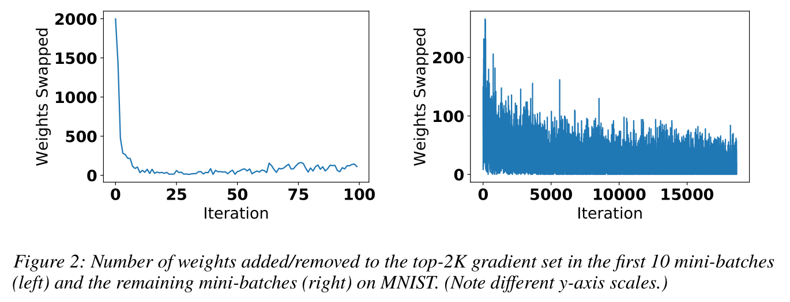
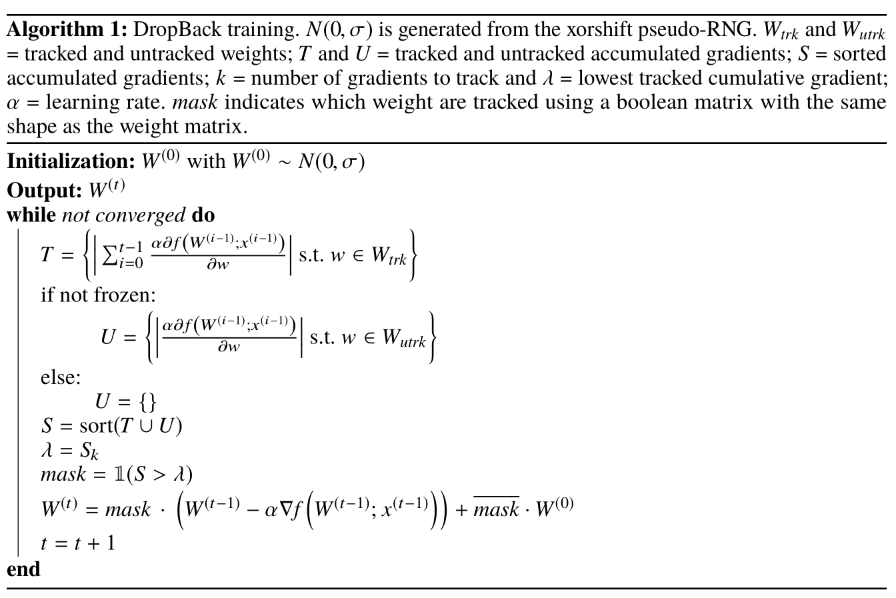

# Info

> @article{DBLP:journals/corr/abs-1806-06949,
>   author    = {Maximilian Golub and
>                Guy Lemieux and
>                Mieszko Lis},
>   title     = {DropBack: Continuous Pruning During Training},
>   journal   = {CoRR},
>   volume    = {abs/1806.06949},
>   year      = {2018},
>   url       = {http://arxiv.org/abs/1806.06949},
>   archivePrefix = {arXiv},
>   eprint    = {1806.06949},
>   timestamp = {Mon, 13 Aug 2018 16:45:57 +0200},
>   biburl    = {https://dblp.org/rec/bib/journals/corr/abs-1806-06949},
>   bibsource = {dblp computer science bibliography, https://dblp.org}
> }

# Contribution

- DropBack prunes the network from the start of training and does not require a retraining pass. Also, it only needs enough weight memory to store the unpruned weights. Because DropBack recomputes initialization parameters, it can prune layers like batch normalization or parametric ReLU, which cannot be pruned using existing approaches.

- DropBack outperforms best-in-class pruning methods (which require retraining) on network architectures that are already dense and have been found particularly challenging to compress

- Note that DropBack is very different from techniques like Dropout (Srivastava et al., 2014) or DSD (Han et al., 2017), which temporarily restrict the gradients that can be updated as a regularization technique. In contrast, DropBack specifically restricts updates to gradients that have not substantially contributed to the overall optimization gradient, and does not involve retraining phases on either the pruned or dense network.

  - Han, Song, Pool, Jeff, Narang, Sharan, Mao, Huizi, Gong, Enhao, Tang, Shijian, Elsen, Erich, Vajda, Peter, Paluri, Manohar, Tran, John, Catanzaro, Bryan, and Dally, William J. DSD: Dense-Sparse-Dense Training for Deep Neural Networks. In International Conference on Learning Representations (ICLR), 2017.

  - Srivastava, Nitish, Hinton, Geoffrey E, Krizhevsky, Alex, Sutskever, Ilya, and Salakhutdinov, Ruslan. Dropout: A Simple Way to Prevent Neural Networks from Overfitting. Journal of Machine Learning Research, 15(1):1929–1958, 2014.

# Observation & Insight

- that the parameters that have accumulated the highest total gradients account for most of the learning; 

  - As post-training pruning techniques delete weights with the lowest values, it may **seem natural to keep track of gradients for the weights with the highest values**. However, this naïve approach is not effective during the first few training iterations.

  - Informally, this is because the initial value of each weight, typically drawn from a scaled normal distribution (LeCun et al., 1998), serves as scaffolding which gradient descent can amplify to train the network.

  - our approach is to track gradients for a fixed number of weights which have learned the most overall—that is, **the weights with the highest accumulated gradients**.

  > 难道不需要存储gradient accumulation吗？？？？？？

- that the values of these parameters are predicated on the initialization values chosen for the remaining parameters; 

- that initialization values can be recomputed on-the-fly without needing to access memory，这为端训练提供可能。

  - While it may be intuitive to simply set untracked weights to 0, we observed that **preserving the scaffolding provided by the initialization values is critical to the accuracy of the trained network**.

  - we observe that in practice the initial values are generated using a pseudo-random number source that is initialized using a single seed value and postprocessed to fit a scaled normal distribution. Because **each value only depends on the random seed value and its index, it can be deterministically regenerated exactly when it is needed for computation**, without ever being stored in memory.

- we trained a 90,000-parameter MLP on MNIST using standard SGD while keeping track of which parameters were in the top-2K gradients set. Figure 2 shows that the set of the highest-gradient weights stabilizes after the first few iterations. This observation allows us to **freeze the "tracked" parameter set after a small number of epochs**, saving more energy-costly memory accesses.

# Training Algorithm

> 最后作者讨论了为什么Dropback在on-device training的场景下会很有效（Section 4 Discussion）
> 
> 还在找代码中……

