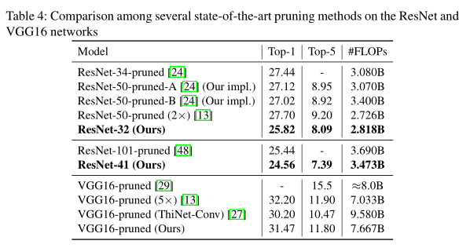
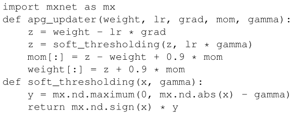
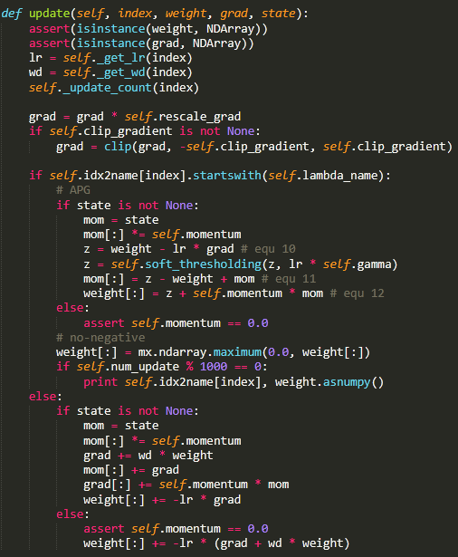

# 已完成的工作(正在follow的论文)

- [x] 阅读论文《Data-Driven Sparse Structure Selection for Deep Neural Networks》

  这篇论文是做稀疏化训练的，在每一个output channel后添加一个channel-wise scalar，这一点和我们算法课程大作业 "critical path" 的control gate设计是一样的，不同的是在这篇文章中，在更新网络参数Weight的同时训练scalar，L1范数使scalar趋近0，这样就实现了channel-wise pruning。

  > Abstract. Deep convolutional neural networks have liberated its extraordinary power on various tasks. However, it is still very challenging to deploy state-of-the-art models into real-world applications due to their high computational complexity. How can we design a compact and effective network without massive experiments and expert knowledge? In this paper, we propose a simple and effective framework to learn and prune deep models in an end-to-end manner. **In our framework, a new type of parameter – scaling factor is first introduced to scale the outputs of specific structures, such as neurons, groups or residual blocks.** Then we add sparsity regularizations on these factors, and **solve this optimization problem by a modified stochastic Accelerated Proximal Gradient (APG) method**. By forcing some of the factors to zero, we can safely remove the corresponding structures, thus prune the unimportant parts of a CNN. Comparing with other structure selection methods that may need thousands of trials or iterative fine-tuning, our method is trained fully end-to-end in one training pass without bells and whistles. We evaluate our method, Sparse Structure Selection with several state-of-the-art CNNs, and demonstrate very promising results with adaptive depth and width selection.

  实验部分，作者和这几种方法做了比较

  > 1. Li, H., Kadav, A., Durdanovic, I., Samet, H., Graf, H.P.: Pruning filters for efficient ConvNets. In: ICLR (2017)
  > 2. He, Y., Zhang, X., Sun, J.: Channel pruning for accelerating very deep neural networks. In: ICCV (2017)
  > 3. Ye, J., Lu, X., Lin, Z., Wang, J.Z.: Rethinking the smaller-norm-less-informative assumption in channel pruning of convolution layers. In: ICLR (2018)
  > 4. Molchanov, P., Tyree, S., Karras, T., Aila, T., Kautz, J.: Pruning convolutional neural networks for resource efficient inference. In: ICLR (2017)
  > 5. Luo, J.H., Wu, J., Lin, W.: ThiNet: A filter level pruning method for deep neural network compression. In: ICCV (2017)

  实验结果：牺牲1%的accuracy，但是得到了更少的FLOP，我觉得实验不具有说服力。

  

# 未完成的工作

### 任务

PyTorch复现论文，修改VGG-16（在output channel后添加element-wise scalar，称为gate） ，在loss function中添加gate的L1范数使其稀疏。

我们与原作者的区别：把gate二值化(0 or 1)，如何训练二值的gate参考了神经网络量化的训练方法：

- 初始化时，gate 都是浮点数

- forward函数中，用二值化后的gate与output channel做channel-wise multiplication
- backward函数中，传回来的gradient去更新二值化前的浮点数gate
- 模型训练结束后，只保留量化后的gate value

### 具体pytorch实现：自定义gateLayer层

- [x] gateLayer.forward()

  > 没有问题，只需要执行一个channel-wise multiplication

- [ ] gateLayer.backward()

  > proximal gradient descent实现，这周没肝出来

论文中的gradient descent实现，函数声明：
$$
\text{learning rate}: \eta_t \text{ at epoch }t,\text{ weight of L1-norm}: \gamma \\
\text{soft-threshold function}: S_\alpha(z) = \text{sign}(z)(|z|-\alpha)\\
\text{object function}: G(\lambda) = \frac{1}{N}\sum_i Loss(y_i,C(x_i,\lambda))
$$
以下是公式推导：
$$
\lambda'_{t-1} = \lambda_{t-1} + \frac{t-2}{t+1} (\lambda_{t-1}-\lambda_{t-2})\\
z_t = \lambda'_{t-1} - \eta_t \nabla G(\lambda'_{t-1})\\
v_t = S_{\eta_t\gamma}(z_t) - \lambda'_{t-1} + \frac{t-2}{t+1} (\lambda_{t-1}-\lambda_{t-2})\\
\lambda'_t = S_{\eta_t\gamma}(z_t)+\frac{t-2}{t+1}v_t
$$
作者在论文里还贴了图：

作者的源代码：MXNET继承了封装好的SGD，所以update()的state, index等变量都是封装好的。

### 我的实验

- [ ] 模型训练结束后，统计CIFAR100的准确率
- [ ] 训练过程中，统计不同卷积层的gate value中有多少0和1