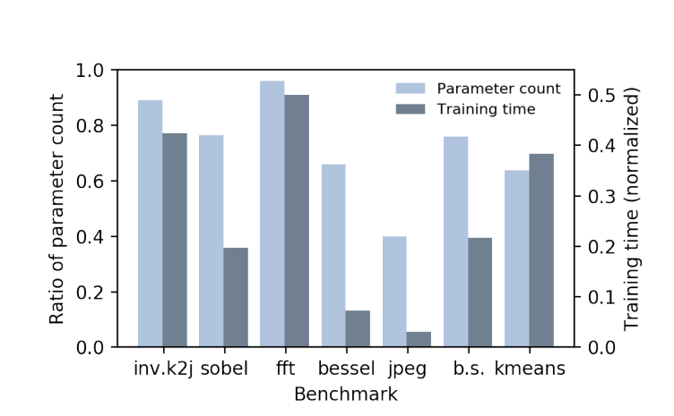

# AXNet: ApproXimate computing using an end-to-end trainable neural network 
### Abstract

基于神经网路的近似计算是一个对容错性很高的应用节省大量计算的通用的架构。为保证近似的精度，现有的工作采用了两个神经网络的架构，一个为近似器，一个为预测器。近似器用于近似j计算结果，预测器预测给定数据是否能够安全地被预测（在给定精度的情况下）。但是将两个网络结合起来是不简单而且费时的，因为他们有不同的目标函数，他们需要被不同地训练。本文提出了一种新的网络架构AXNet将以上两种网络融合成一个整体的网络。在受到多任务学习（Multi-task Learning）的启发后设计的AXNet网络模型大大提高了激活率，而且减少了近似的误差。用于训练的资源也大大减小了。实验结果表明于前人的工作进行对比，此网络结构下有50.7%的激活率和训练时间被减少了

### 目标

原有的神经网络近似近似计算的模型中有：approximator（近似器）和predictor（预测器）

这样的方法有如下问题：

- first train the best approximator and consequently the best predictor separately. The ignorance of the interaction between those two NNs plunges the approximate computing to a local optimum.  
- 如果是iteratively training：it inevitably causes exceptionally long training time. 

The obstacle to making the two NNs cooperation is that two NNs in the approximate computing framework—although share the same training data—have different tasks: prediction and regression.

本文用多任务学习的方式学习以上两个模型：share 参数 

### 算法

#### Failure

出现的问题：

问题有：

- 

#### Architecture

### 实验

#### 实验设置

- AXNet
- onepass
- iterative

Evaluation Metrics:

- True Invocation: the proportion of safe-to-approximate samples among all the testing data. 检测approximator的性能

- Predicted Invocation: the proportion of samples that the prediction subnet believes to be safe-to-approximate among all testing data. 检测predictor的性能
- Prediction Accuracy: the proportion of samples that are safely approximated meanwhile predicted as safe-to-approximate. 
- Approximation Error: the mean error of approximation results for those predicted safe-to-approximate
  samples, also called “overall error”. 检测approximator的性能

#### 实验结果

- True Invocation

- Predicted Invocation

This is because the iterative training method selects the training data in favor of the classifier.  

- Overall Approximation Error

- the variation of the true and predicted invocation by varying the network topology, i.e., adjusting the
  number of neurons in hidden layers.  

- the ratio of parameter count and the training time of AXNet compared to iterative training 

- Comparisons on the energy efficiency 

the enhancement of the true invocation contributes to the improvement of the energy-efficiency. 

- Investigation of the scalability of AXNet by fusing two subnets in three ways 

two ways for the fusion of subnets: 

​	at all hidden layers of approximation subnet 

​	apply Hadamard product only in the first hidden layer of the approximation subnet

​	only in the second hidden layer, respectively. 

