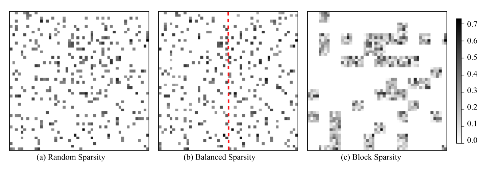
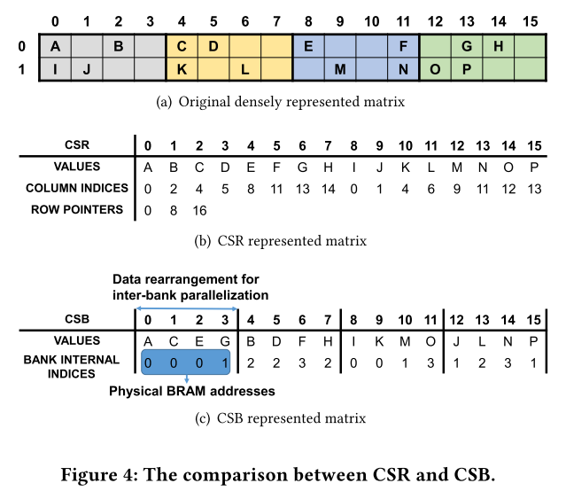
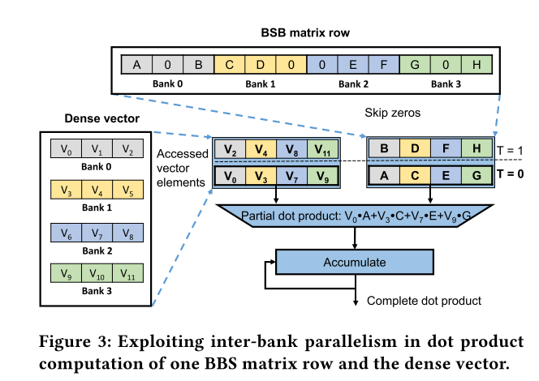

# Balanced Sparsity 相关两篇论文

## 核心思想

### Balanced Sparsity （GPU的文章）

定义：把矩阵分成大小相同的BLOCK，每一个BLOCK有数目一样的非零值

上图是三种Sparsity的对比图，Random Sparsity不好利用，Block Sparsity可以利用但是损失的信息太多了，容易掉精度。Balanced Sparsity结合了二者的优点，可以看出来Balanced Sparsity的分布和Random相似，这说明这样的稀疏更能保证精度，同时Balanced Sparsity每一个BLOCK非零值相同的假设也很有用，通过这个假设可以工整地安排矩阵的表达方式，以及调度并行模式

### Compressed Sparse Banks （LSTM的文章）

如何表示Balanced Sparsity的一个矩阵？见上图（c），表示方法由两个数列构成，第一个数列是矩阵的非零值，第二个数列是这个非零值在矩阵block中的位置。非零值得排列是：先把第一行中的所有block中的第一个非零值排在一起，然后后面再排所有block的第二个非零值，以此类推。这样跨block排在一起的好处是方便后面并行时读取连续内存。由于矩阵具有Balanced Sparsity，所以每一个block中的非零元素个数相等，所以这个表示方法可以工整地表示一个矩阵。

### Balanced Sparsity parallel 

利用这个压缩表示的矩阵如何并行计算，文中的方法是在bank之间并行，先把每个bank的第一个数和对应的乘数准备好，然后并行相乘，再计算每个bank第二个数和其对应的乘数的乘积并累加。