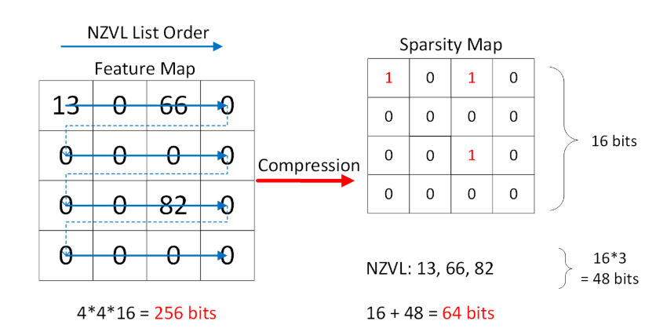
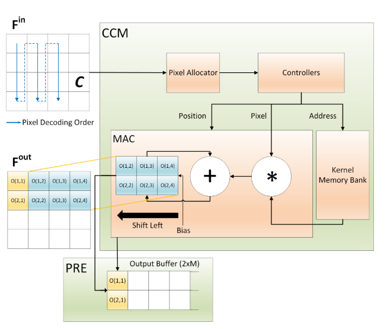
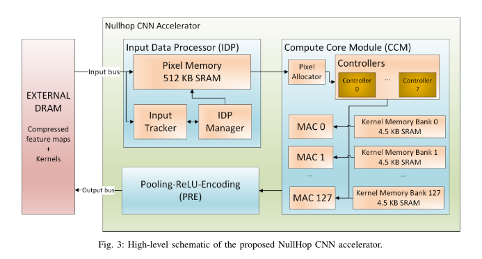
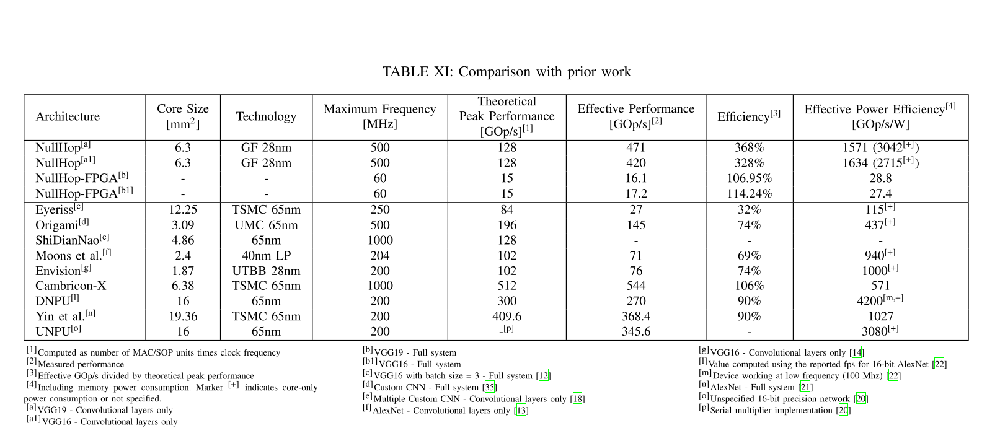

#NullHop: A Flexible Convolutional Neural Network Accelerator Based on Sparse Representations of Feature Maps

这文章主要是描述一个**神经网络加速器**，利用神经网络的激活的**稀疏性**来减少**前向传播**运算。这个加速器专门适用于**CNN**，**RELU**作为激活函数，并且对网络激活值的稀疏性有一定的要求。

## 加速思想核心：

### 稀疏的表示方法：

对一个激活的feature map，经过RELU，只关注其不为零的数据。用Sparsity Map (**SM**) 表示非零元素的位置，用 Non-Zero Value List (**NZVL**)来表示为零元素的数值。

### 利用稀疏的计算方法：

对于非零的激活值，计算这个激活值会对feature map哪些位置产生影响，对应乘kernel的值，在相应位置累加。 上述过程在不同输出feature map之间并行。

## 架构工作流程：

#### 压缩好的feature map从external DRAM 发送进来

发送的格式是16bit的SM map值和16bit的激活值（架构中所有的激活值都是16bit定点数）交叉发送。

### Input Data Processor 解码

解码并不是把整个feature map展开，而是为了后面向CCM发送non-zero pixels和相对的位置

每一个时钟周期可以向后发送 $k_h+1$个 pixel.

### CCM 对pixel在相应位置做乘加运算

CCM中每一个MAC对应一个output feature map，一一的kernel Memory Bank里面保存了这个output feature map 对应的所有kernel，每一个pixel传进来的时候，这个pixel的值广播给所有的MAC, kernel Memory组合，各个组合并行取出响应的kernel值相乘，然后累加到相应位置上。

CCM中的controllers有很多组，在一个时钟周期，一个controller 发出一个address，调配它组内所有的MAC， kernel memory bank组合计算。

但是如果输出的output feature map的数量和MAC的数量不匹配的话，就需要把工作量拆开。如果$N_{out}$的数量小于$M$(MAC的数量)，那么需要几个MAC同时计算属于同一个feature map上的激活值，最后累加起来。pixel allocator 的发送速度可以提高，一个周期并行发送几个pixel，交给不同的controller处理。

如果$N_{out}>M$ 那么可以一次计算$M$ 个feature map， 如果kernel Bank 装不下这么多的kernel数据，那么可以把这些kernel分在两个kernel Bank中。 最后叠加对应的两个feature map.

### CCM从累加器推到output buffer

如果现在推进来的pixel位置已经不会影响到累加器最左边一列的feature map的值了，那么就把累加器的最左一列推到output buffer map上，新的一列初始化为 $b$ (bias)

### PRE把需要求和的feature map加起来

对应一个feature map的任务推到好几个MAC的情况。

两两相加，使用$log(size(luster))+1$ 个周期

### PRE 处理以及编码

pooling 的原理和relu的处理都是在从PRE buffer到 output buffer传输的时候取 max 完成的

在两个buffer 传输的过程中，如果目标buffer 位置存的是0，那么取max的结果相当于打开了 relu功能。

类似，如果一次传输两列，四个数里面取得最大的，那么相当于打开了2*2 pooling的功能

## 试验结果：

作者在实验分析中提到， VGG这样的大网络在这个架构上面的利用率比较高

但是VGG的第一个卷积层，以及自己设计的GigalNet（一个专门别扭这个芯片的小网络还有Roshambo Net 和一个小的 Face Detector）都卡在了output bus的带宽上面，主要的瓶颈都是IO。

# 讨论：

### 激活值的稀疏性vs结构的稀疏性

这个工作仅仅利用了激活值的稀疏性，而实际上我们做剪枝，很多卷积核的稀疏性等等都是可以利用的。本文在参考文献里面提到了利用结构稀疏性的工作，还有待进一步探索

