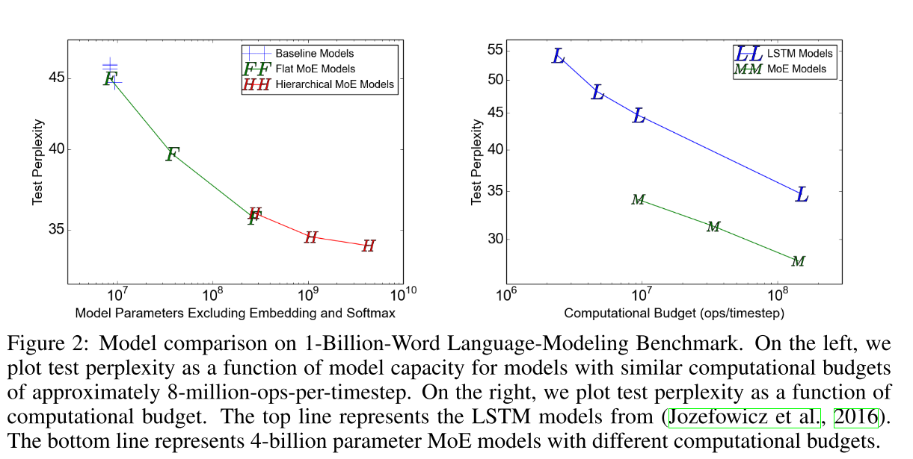
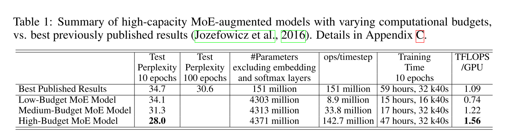

# OUTRAGEOUSLY LARGE NEURAL NETWORKS: THE SPARSELY-GATED MIXTURE-OF-EXPERTS LAYER

## 核心思想：

利用conditional computation， 增大网络的capacity。引入一个叫做Mixture-of-Experts layer (MoE) 的模块，一层放大概几千个expert，用一个gait选取其中的几个（比如4个)(使用有梯度的方法)，把这些expert的结果相加。

## 细节：

### 解决一个batch内的输入走了不同分支的问题

**问题来源：**

把数据整理成batch可以提高计算的性能，而对于某一个expert而言，只有一个batch中的几个输入是用到了它的，那么单独为了这几个输入过一遍这个expert十分浪费，不能实现利用conditional computation提升性能的初衷。

**解决方法：**

**改变集群上的并行模式**

原来的并行：有一个参数服务器，然后其它的机器都在独立计算（data parallel）。

改进之后的并行：把网络中的一般部分（非expert的部分）在所有节点上进行data parallel。在expert上进行model parallel。每个机器上只负责某几个expert的计算任务，收集前面节点的激活了这个expert的输入，组成新的batch，然后计算这个expert的结果，再往后传。（文章没有点明，但是我觉得就是**map reduce**的思想）

### 使用Noisy Top-K Gating选择expert

在Gait模块算完之后，每一个expert对应一个值，加上高斯噪声，然后选取最大的K个，然后经过softmax作为这个expert的结果的权重。每一个expert结果加权相加。

### 解决每个expert成长速度不一样的问题

**问题描述：**

实验中观察到这样的做法会使得gait倾向于选某几个expert，而这是一个恶性循环，成长地慢的expert不容易被gait使用所以成长的机会更少。

**解决方法：**

加loss

文中提到两个Loss，一个是$L_{importance}$ ,是gait值的方差（先在一个batch里面求和）。这个loss不能体现一个batch中稳定的小值，和忽大忽小的值的区别（因为他们最后的和都一样），所以文中提出$L_{Load}$ 一起使用。

## 实验与结果：

文中在LSTM和语言任务上做的实验，

这个图体现他们capacity大的意义，**F** 是一层MOE的模型（4，32，256个expert），**H** 是两层hierarchical的MOE的模型（256,1024,4096个expert）。每一次都是选取四个expert，可以看出**模型大了之后精度可以明显提高**。（由于分支的作用，**模型大了并不导致FLOPS增加**）

和现在最好的精度的比较，注意training time都小于state of art。

**TFLOPS/GPU** 是为了衡量论文中并行设计好坏的指标，是FLOP除以实际需要的时间（单位GPU）。可以看出，借助于文中的并行方式，这个指标也能比start of art 好。

## 想法与感悟：

### 新想法

这个框架可以扩展到端之间的协同训练和关键路径等等，比如全网总共1024个expert，每一个端设备只保存128个，每次只使用4个expert。端上一直使用和训练这128个expert，云服务器时不时地来端上检查这128个expert的使用结果，比如有没有expert逐渐被淘汰掉，有没有出现出类拔萃的expert，服务器把端训出来的好的expert复制到云上，然后把新的expert派到端上，代替被淘汰的expert。

这样的好处是:

1. 每一个端都有自己的expert，可以应对数据分布不独立的问题，也能维持网络的可拓展能力
2. 端和云之间的数据交换只有expert的拷贝，这样有助于隐私保护（相比传梯度而言）

### 感悟：

我前面的时候也在思考走了不同的分支之后向量化会被破坏的事情，但是读了这篇文章之后，我意识到这只是一个细枝末节的小事情，我前面的思维被框架框住了，所以回到我现在在做的down sampling的事情上，完全可以尝试每一个feature map尺寸不同的想法！

