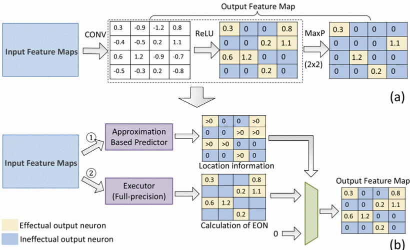

# Prediction Based Execution on Deep Neural Networks

文章链接：[click here](https://ieeexplore.ieee.org/abstract/document/8416870)

作者发现即使使用zero-removal technique加速，网络依然有冗余。

> We observe that many output neurons are still ineffectual even if the zero-removal technique has been applied.

因此作者的思想是预测无效的输出神经元，从而避免无意义的计算。

作者提出一种基于预测的（prediction-based），无损的（without accuracy loss），两步神经网络执行模型（two-stage DNN execution model）。

不但能实现网络加速，也能节省内存。

> It can also tackle the challenge of memory access since each output neuron has its own filter in FCN layers and there is no need to load the filters when their corresponding output neurons are ineffectual;

## Keywords

| keyword                           | description                                                                                                                                                  | researchers' oboservation                                                                                                                                                                                                |
| --------------------------------- | ------------------------------------------------------------------------------------------------------------------------------------------------------------ | ------------------------------------------------------------------------------------------------------------------------------------------------------------------------------------------------------------------------ |
| ineffectual output neurons (iEON) | those output neurons that have no influence on the subsequent layers since they are filtered out by the non-linearity layers in DNNs, such as ReLU and MaxP. | 【Our Motivation】If we can predict the iEONs in advance, we can skip over the whole computation process (including those non-zero-valued operand multiplications) relates to these iEONs and greatly improve performance. |
| Cnvlutin                          | designed for eliminating zero-valued operand multiplications to reduce computational operations without the sacrifice of accuracy                            |                                                                                                                                                                                                                          |

## Related Works

基于剪枝的DNN accelerator，缺点是需要retrain才能达到原网络的性能。

- Song Han, Xingyu Liu, Huizi Mao, Jing Pu, Ardavan Pedram, Mark Horowitz, Bill Dally, "EIE: Efficient Inference Engine on Compressed Deep Neural Network",*ACM/IEEE 43rd Annual International Symposium on Computer Architecture (ISCA)*, 2016.

- Han Song, Huizi Mao, William J. Dally, "Deep Compression: Compressing Deep Neural Networks with Pruning Trained Quantization and Huffman Coding",*International Conference on Learning Representations (ICLR)*, 2016.

基于近似计算的DNN accelerator，缺点是牺牲了性能。

- Michael Figurnov, Dmitry Vetrov, Pushmeet Kohli,*PerforatedCNNs: Acceleration through Elimination of Redundant Convolutions*, Apr. 2015.

- Cheng Tai, Tong Xiao, Yi Zhang, Xiaogang Wang, Weinan E.,*Convolutional neural networks with low-rank regularization*, Nov. 2015.

- Xiangyu Zhang, Jianhua Zou, Xiang Ming, Kaiming He, Jian Sun,*Efficient and Accurate Approximations of Nonlinear Convolutional Networks*, Nov. 2014.

这篇文章follow的是Cnvlutin的工作。

- Jorge Albericio, Patrick Judd, Tayler Hetherington, Tor Aamodt, Natalie Enright Jerger, Andreas Moshovos, "Cnvlutin: Ineffectual-Neuron-Free Deep Convolutional Neural Network Computing",*ACM/IEEE 43rd Annual International Symposium on Computer Architecture (ISCA)*, 2016.

- 原工作对含0的卷积计算进行了优化，从而实现网络计算加速。aims at eliminating zero-valued operand multiplications to reduce computational operations without the sacrifice of accuracy. It is inspired by the fact that Rectifier Linear Unit (ReLU) results in abundant zeros in the input feature maps

但是Cnvlutin存在的问题有；

- First, many output neurons (after non-linearity layers such as ReLU and Max-pooling) are still ineffectual even if the zero-removal has been applied. Since an ineffectual output neuron cannot pass its value to next layer, this means all the computations (including non-zero-valued operand multiplications) related to these output neurons are futile and wasteful. 

- Second, *Cnvlutin* mainly focuses on convolutional (CONV) layers. However, since most of the filter weights are in fully-connected (FCN) layers, *Cnvlutin* could not reduce the memory access overhead. 

- Third, the existence of Max-pooling (MaxP) layer in DNNs greatly reduces the amount of zeros, and this can stultify the zero-removal technique of *Cnvlutin*.

## Proposal

#### 1. Two-stage: Predictor-Executor

During the prediction, we are not interested in the specific numerical value of each output neuron and only concern about whether they are positive (CONV-ReLU) or what their relative values are (CONV-ReLU-MaxP).

Predictor在设计上的难点：

- 执行模块依然需要全精度计算

- 预测模块引入额外的开销

- EONs的稀疏性质难以并行

> First, the location information of EONs obtained from the predictor could not be leveraged by the executor in Step 2. The executor still needs to perform the full-precision calculation inFig. 3(b).  Second, the integration of predictor introduces additional area overhead. Finally, the sparsity of EONs in the output feature maps challenges the traditional DNN accelerator parallelization design.

#### 2. Uniform Serial Processing Element (*USPE*)

#### 3. Scale-out Design of USPE to maximize the processing throughput
