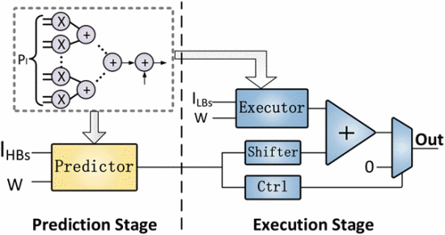

# Prediction Rationale

$\underbrace{O(m, x_{o}, y_{0})}_{\text{Output Neuron}}=\sum\limits_{y_{i}=0}^{K_{y}-1}\sum\limits_{x_{i}=0}^{K_{x}-1}\sum\limits_{n=0}^{N-1}\underbrace{w^{m}(n, y_{i}, x_{i}}_{\text{Filter Weight}})\times\underbrace{i(n, y_{i}+x_{o}\times S, x_{i}\times S}_{\text{Input Neuron}})$

$o =\sum W\times I=\sum W\times (I_{HBS}\ll N_{LBs}+I_{LBs})\\  =(\underbrace{\sum W\times (I_{HBS})\ll N_{LBs}}_{\text{Predction Stage}}+\underbrace{\sum W\times I_{LBs}}_{\text{Execution Stage}}$ 

> 没有找到对high-order & low-order的声明。而且为什么引入splitting的思想？

As the input neurons ($I$) can be separated into high-order bits ($I_{HBs}$) and low-order bits ($I_{LBs}$), the calculation in (1) is equal to the sum of two parts shown in (2): the sum of products of $I_{HBs}$ and $W$ and the sum of products of $I_{LBs}$ and $W$.

> 介绍了为什么high-order bits的结果能够预测output neuron的正负号，还是没看懂。

Since the value of the output neuron is mainly dominated by the calculation related to high-order bits (Prediction Stage), the calculation results of Prediction Stage can be leveraged to predict the positive or negative sign of output neurons (CONV-ReLU) or their relative values (CONV-ReLU-MaxP).

- First, the predictor predicts the locations of EONs only using high-order bits of input neurons. Then, for each of these EONs, the executor continues to conduct the remaining calculation with the low-order bits of input neurons. Finally, the executor obtains the final values of EONs by adding its results with the results of Prediction Stage (reusing the results of predictor).

- Specifically, we unroll its input feature maps and the parallelism granularity（并行粒度） is $P_I$, which accounts for the number of multipliers.

- The high-order/low-order bit splitting also is applicable to filter weights ($W$).

- 统计了与原模型相比，Memory Access(\<1) 和 Speedup(\>1) 的比率，在 **input splitting in CONV** and **weight splitting in FCN** 条件下模型的加速比和内存占用比都是最好的。原因是CONV is compute-intensive and FCN is memory-intensive。

- 每一层的high-order bits的长度都不相同，没有系统的搜索方法，感觉是实验试出来的。

- 大量的实验结果中可以看到：the number of low-order bits in execution Stage is greatly larger than the number of high-order bits in Prediction Stage（VGG11-CONV: 3-3-1-2-1-2-1-3），所以需要设计一种通用的乘法器。

# Uniform Serial Processing Element
