# Progressive DNN Compression: A Key to Achieve Ultra-High Weight Pruning and Quantization Rates using ADMM 

### Abstract

权重剪枝和权重量化是两个重要的深度神经网络（DNN）模型压缩方法。过去的研究都是都是基于一些启发式的算法做压缩。最近一篇论文提出了一种系统化的基于ADMM的剪枝方法，达到了目前来看剪枝的最好效果。在此论文中，为了增加结果的可行性和更快的收敛速度，我们**扩充了上述的基于一步ADMM优化的模型剪枝方法**，并且**运用到了权重量化上**。我们**在此基础上还提出了多步、渐进式的剪枝与量化方法**，此方法有以下优点：

- 由于ADMM算法的正则项，多步渐进的方法可以达到更好的剪枝与量化的结果
- 减少了每一步ADMM的搜索空间

大量实验表明：

- 分别在LeNet-5、AlexNet、ResNet-50上分别达到了246x、36x、8x的模型剪枝率，而且准确率几乎没有降低
- 在AlexNet上达到61x的剪枝率，并且比前人方法准确率降低得更少
- 首个在ResNet and MobileNet上达到比较好的剪枝率
- 首个在LeNet-5 for MNIST和VGG-16 for CIFAR-10上达到了无损的二进制量化

### 目标&框架

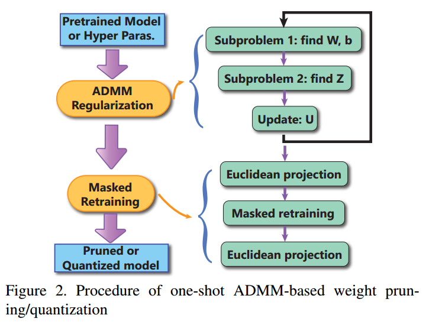

### 算法

- one shot weight pruning framework：copy from [A Systematic DNN Weight Pruning Framework
  using Alternating Direction Method of Multipliers](<https://arxiv.org/pdf/1804.03294.pdf>)
  - 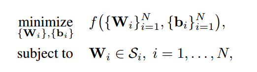
  - 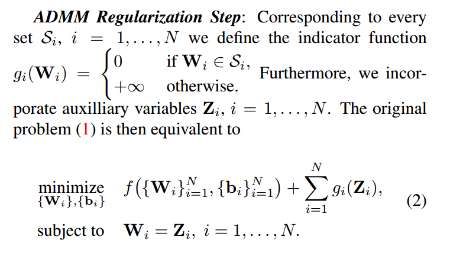
  - 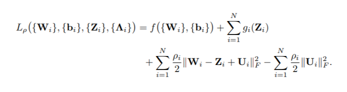
  - 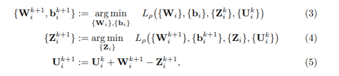
  - 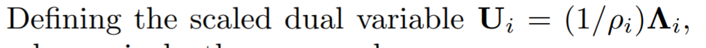
- 子问题1
  - 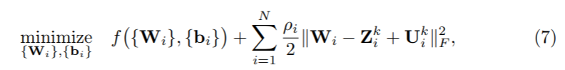
  - 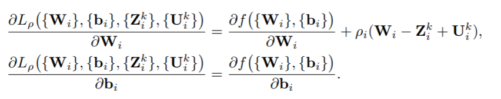
- 子问题2
  - 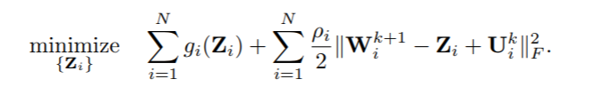
- **Increasing ρ in ADMM regularization** 
- **Masked mapping and retraining** 

- progressive DNN model compression framework
  - large remaining number of small & non-zero weights in one shot pruning
  - Reduce the search space for weight pruning/ quantization each step：reduce the total training time
  - ====》two step progressive procedure（empirically efficient）

### 实验

#### 超参数

- overall pruning rate and specific pruning rate for each layer 
  - Overall: 1.5x prior work in first step; 2x first step in second step
  - Each layer: same as prior work
- Target number of quantization bits：
  - **the first step** performs quantization on all the weights except for the first and last layers; **the second step** performs quantization on these two layers: 
    - **Because** quantization on these two layers has more significant impact on the overall accuracy
- Sensitivity Analysis: the robustness of the hyperparameter determination process 

#### 超参数实验设置

- We have conducted experiments on **CIFAR-10 and ImageNet** benchmarks (**AlexNet and ResNet-18 models**) on the relative accuracy of two-step procedure vs. three-step procedure, in which **each step uses 120 epochs for training** in PyTorch 
- Baseline AlexNet model with 60.0% Top-1 accuracy and 82.2% Top-5 accuracy 

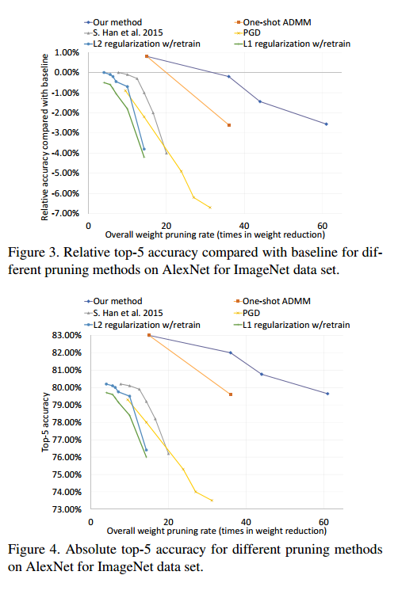

#### Compare to weight pruning method: from a partition point of view

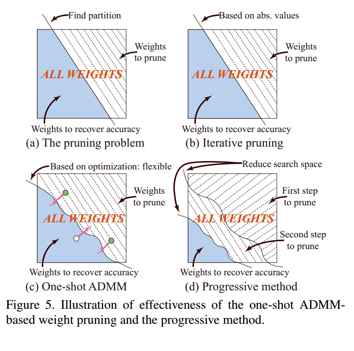

#### Pruning & Compression实验

##### 数据集

- ImageNet ILSVRC-2012

- CIFAR-10
- MNIST 

##### 网络结构

- AlexNet
- VGGNet
- ResNet-18/ ResNet-50
- MobileNet V2
- LeNet-5

##### Training Environment

PyTorch using NVIDIA 1080Ti, 2080, and Tesla P100 GPUs 

##### Baseline

the baseline accuracies are in many cases higher than those utilized in prior work 

##### Comparison Standard

Relative Accuracy compared to baseline

#### 实验结果

##### ImageNet Dataset

- AlexNet
  - 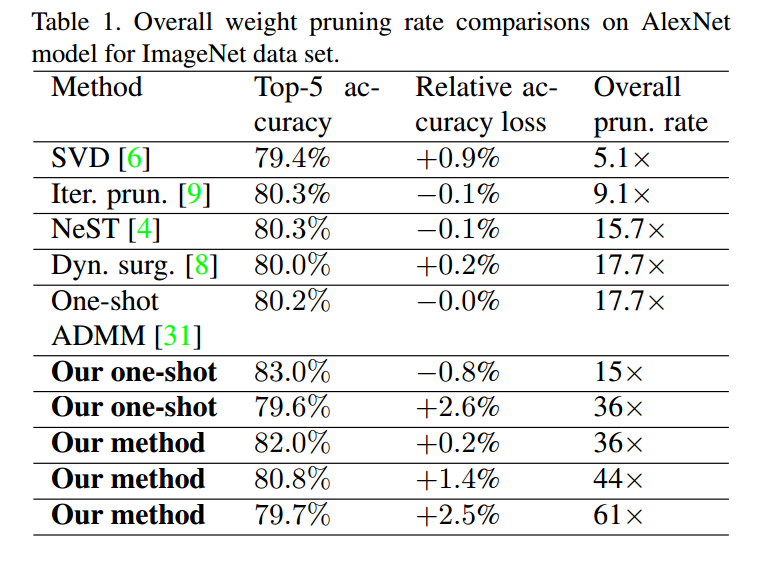
  - 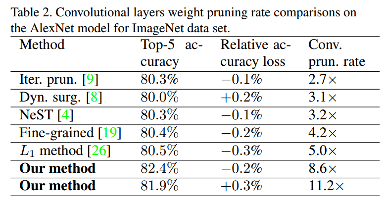
- VGG-16
  - 34x overall pruning rate with no accuracy loss
  - 13× using iterative pruning [9]
  - 15× in [30] (On compressing deep models by low rank and sparse decomposition)
  - 19.9× using our extended one-shot ADMM (no corresponding results reported in [31]) 
- ResNet-18/ ResNet-50
  - lack of effective pruning results before
  - We achieve **8× overall pruning rate (also 8× pruning rate on CONV layers)** on **ResNet-50**, without accuracy loss. 
  - We also achieve **6× overall pruning rate (also 6× pruning rate on CONV layers)** on **ResNet-18** 
  - 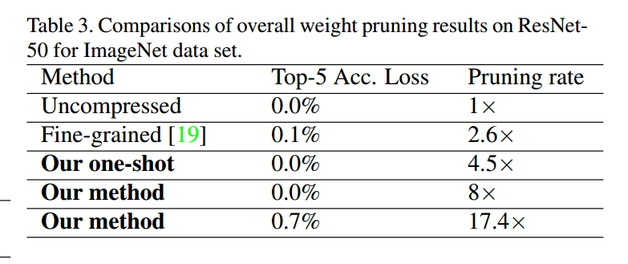

##### CIFAR-10

- VGG - 16
  - baseline accuracy is 93.7% 
  - lack of prior work for fair comparison
  - 11.5× overall weight pruning without accuracy loss, 
  - 40.3× overall weight pruning with accuracy loss of 0.8%. 
- MobileNet V2
  - baseline accuracy is 95.07% 
  - lack of prior work for fair comparison 
  - 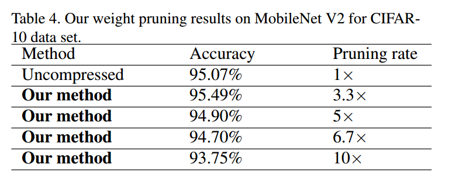

##### MINIST

- LeNet-5 model 
  - 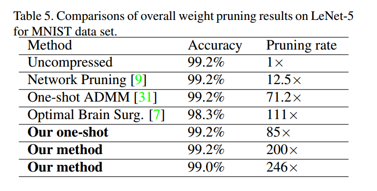

##### Quantization Method

- Binary Weight Quantization Results on LeNet-5 on MINIST
  - the **first** lossless, fully binarized LeNet-5 model: The accuracy is 99.21%, lossless compared with baseline. 
  - recent work results in **2.3% accuracy degradation** on **MNIST** for full binarization, with
    baseline accuracy 98.66% 
- Weight Quantization on CIFAR-10 
  - the **first** lossless, fully binarized **VGG-16** for CIFAR-10 
  - 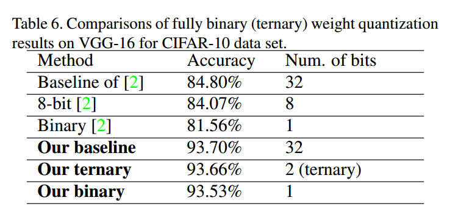
- Binary Weight Quantization Results on ResNet for ImageNet Dataset 
  - 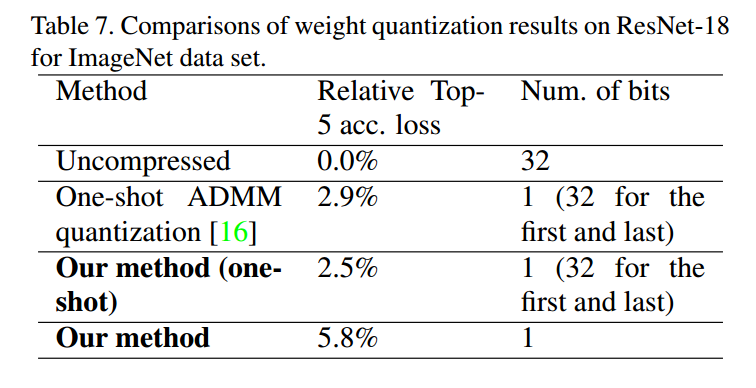

#### Sum up

- 246x compression rate LeNet on MINIST dataset
- 36x compression rate AlexNet on ImageNet dataset
- 8x compression rate ResNet-50 on ImageNet dataset

