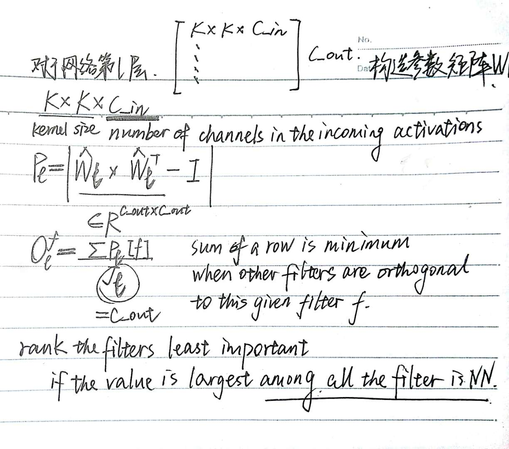

# Motivation

If a model's features are orthogonal to one another, they will each capture distinct directions in activation space, leading to improved generalization.  The directions captured by the activation pattern expresses the capacity of a deep network. Making orthogonal features will maximize the directions captured and thus expressiveness of the network.

> 正交 = distinct directions = 网络泛化能力
> 
> 引用了：Maithra Raghu, Ben Poole, Jon M. Kleinberg, Surya Ganguli, and Jascha Sohl-Dickstein. On the expressive power of deep neural networks. In ICML, 2017.

Because features are dependent on the input data, determining their orthogonality requires computing statistics across the entire training set, and is therefore prohibitive. We instead compute the orthogonality of filter weights as a surrogate. 

> filter卷积出来的特征是否正交，完全取决于输入空间。

Our experiments show that encouraging weight orthogonality through a regularization term is insufficient to promote the development of features which capture the full space of the input data manifold. Our method of dropping overlapping filters acts as an implicit regularization and leads to the better orthogonality of filters without hampering model convergence.

> 添加正则化项去鼓励模型提取正交的特征是不够的（实验证明），而作者的方法作为一种隐式的正则化项却可以在不影响模型敛散性的同时使得filter更加正交。

We use Canonical Correlation Analysis to study the overlap of features in a single layer.

> 这种CCA方法在2016年ICLR上已被证明有效
> 
> ICLR 2016 文章的结论是：“大多数流行的卷积网络学习的都是相似的表示(learn similar representation)” 
> 
> Yixuan Li, Jason Yosinski, Jeff Clune, Hod Lipson, and John E. Hopcroft. Convergent learning: Do different neural networks learn the same representations? 

Standard training for convolutional filters does not maximize the representational potential of the network.

> 作者的实验表明标准的训练并没有最大化网络的表征潜力。

# Algorithm

算法中最重要的其实是$R(f)$，即如何选出需要drop的filters。

