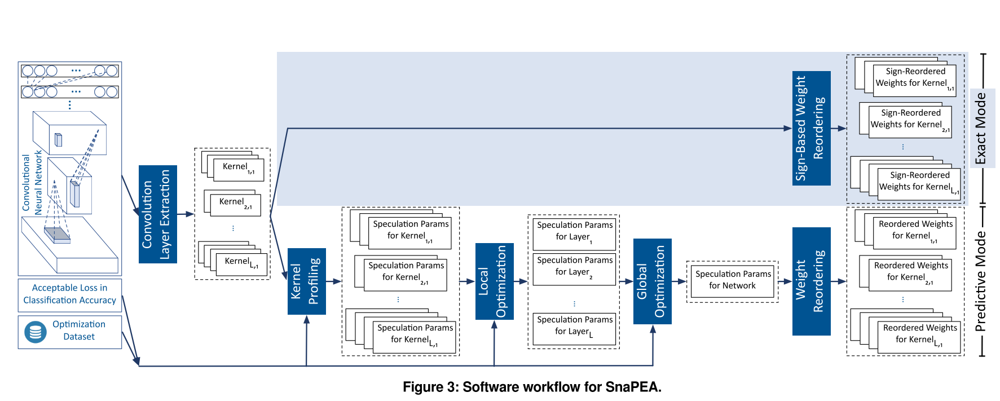
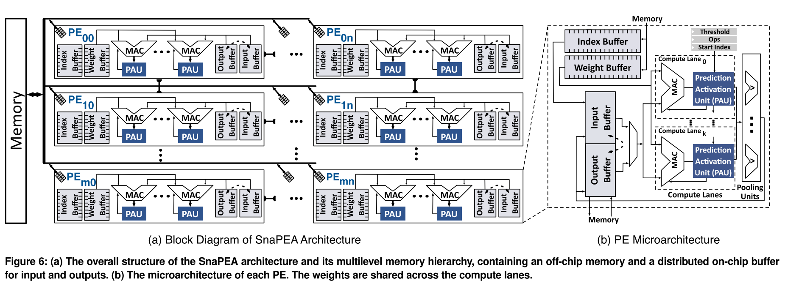
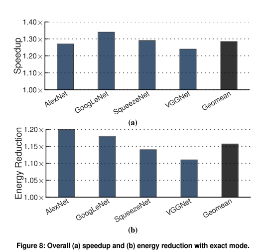
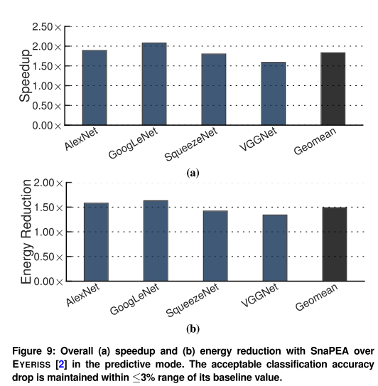
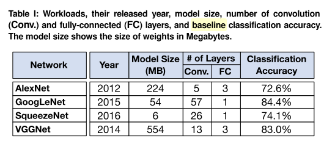

# SnaPEA: Predictive Early Activation for Reducing Computation in Deep Convolutional Neural Networks 论文阅读

## 概述：

这是一篇在软硬件层面进行CNN计算加速的文章，针对CNN RELU 只保留正数的特点，设计算法和硬件支持省去提前终止一定小于零的计算。这个工作作用于**细粒度**的卷积窗计算层面，可以看做一种对卷积运算的加速方法。

#### 核心思想：

对于一个kernel，把所有的卷积核从大到小排序，依次累加卷积核权重和激活的乘积。 由于feature map只有正的，那么如果计算到某一个负的卷积核权重的时候，累加的结果已经小于零了，那么这个时候就可以终止计算，因为后面再累加的结果也仅仅是负的权重和正的激活值的乘积，会被RELU过滤掉。

为了进一步加速，文中在上面的思想的基础上进行了提高，预测计算的结果会不会小于零。判断的方法是设定一个阈值**th**，和用来检验的**n**个权重的和，组成$(Th,n)$ 参数对。在计算的过程中，累加前n个权重的乘积结果，如果比Th小，则认为最后的结果会被RELU过滤掉。

上一段说到的Th 和n 的参数对，本文是关于通过类似选超参数的思想学出来的。再具体一些的思路是：先对于每一个kernel 确定不同的参数对会带来多大的计算量以及精度损失（通过在数据集上实测），“profiling”这些信息。然后再组合不同kernel的参数配置，在数据集实测，微调。最后得到能满足精度要求的，计算量最小的参数对。

上图中是算法处理一个CNN的过程，上面的流程是没有预测的模式（Exact Mode），下面的流程是有预测的模式（Predictive Mode）。有预测的模式除了要给权重重新排序之外，还通过大量实验确定了阈值Th和为了与阈值比较，需要计算的权重数n。为了确定这个参数对（Th，n），算法需要从局部尝试参数对到后面针对全局调优

硬件的架构比较类似于GPU，有很多相互独立的计算单元组成。每一个计算单元（PE）内部包含几条MAC计算线（lane）。在每一个循环中，PE内的控制器从大到小对于所有的计算线广播卷积核的权重weight，并且伴随相应的位置信息，几条计算线各自取出feature对应的值相乘并且累加。预测模块（Prediction activation Unit）负责判断最后的输出会不会小于零并且，提前终止累加。**当一个计算线（lane）提前终止之后，它会idle等待其它的lane结束**。为了保持input buffer的一致，在PE之间也有这样的空闲等待。

##实验结果

Baseline 选取的是 EYERISS  accelerator。 包括精度3%的基准也是来自EYERISS的精确度（见下表）

##思考与讨论

#### 结合Nullhop文章的稀疏激活思想

NullHop 那篇文章的思想是利用feature map上面的稀疏性很大，计算的时候只需要一个一个关于非零activation来循环就可以了，不需要一行一行或者一列一列地来计算。那篇文章按照activation来分割的方法和这篇文章按照weight来计算的想法在一定程度上可以结合。

Nullhop文章中，有一个控制器对下面所有的计算单元广播activation和其位置，而下面所属的一个单元代表一个output channel。因为一个activation会影响多个channel。

本文中，有一个控制器广播weight和其相对位置，下面所属的计算单元应该代表一个卷积窗的输出值。控制器应该需要广播和这一个output channel有关的所有卷积核的weight值。

所以如果我们要结合这两个工作的话，就需要一个层级的结构。比如上层控制器广播weight的值，然后下层控制器广播activation的值，计算单元把weight*activation累加在响应的缓存区域，并且控制提前终止。这样的设计可能不利于工作量的划分，可能需要很大的一块缓存来存放结果，具体能不能起到加速功能还要再进一步分析。

####本文选取的一个全局最优的参数，与输入无关

本文在predictive mode的时候有两个参数需要确定。这里确定的方法是通过在整个数据集上的实验来为整体确定一个参数对。这个参数对也许可以对特定的输入特定地计算。但是考虑到一个参数对仅仅作用于一层，而带来的计算量的节省也仅仅是这一层少了几个乘加运算，我们实时计算参数对的话引入的overhead不能特别大。所以本文采用一个通过大量实验确定参数对的方法，看着比较愚蠢，但是也许是一个很合情合理的做法。

