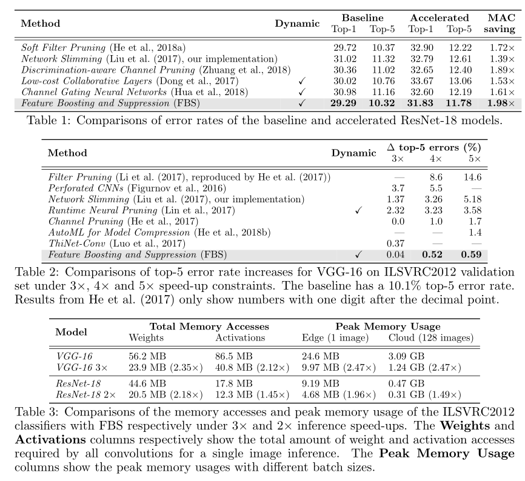

# Section 1  A Brief Review of Network Pruning

神经网络剪枝分为三大方向：kernel-level，channel-level，layer-level。

我认为layer-level就是一种网络架构搜索(NAS)，对于我们的项目(resource-constrained)不可能实现。

kernel-level剪枝的思路是：将3\*3的kernel删成2\*3或更小的kernel，对应到参数矩阵，即删掉了若干行，同样绝对有压缩的效果，而这种裁枝并没有改变channel的个数，虽然输入矩阵的列数需要减少，但这是在im2col操作中进行的(以kernel和stride不同设置，会生成不同的输入矩阵)，对输入特征图与输出矩阵没有任何影响。其中还有一种分支叫Group-level，把kernel裁剪成特定shape的kernel。kernel-level的工作往往对底层硬件有很高的要求。

目前的工作主要集中在了channel-level方向，即，img --> one convolutional filter (kernel) --> one channel，基于channel设计了一系列算法，prune冗余的convolutional filter。因为计算量主要集中在卷积计算，所以达到了网络剪枝和推理加速的效果。

可以作为experiment baseline的方法（data from feature boosting and suppression）

# Section 2 脑洞

one image (8\*8) --> convolutional filter (3\*3) --> output channel (5\*5)

output channel (5\*5) --> binary control knob --> 

if knob==0: close the corresponding filter

if knob==1: normal propagation 

这种二值的变量无法通过反向传播训练，目前的工作集中在强化学习，将knob设计成一种Agent。。。。

# Section 3 关于强化学习
目前state-of-the-art的通过强化学习Policy，进行模型压缩的工作是Han Song ECCV2018的工作：《AMC: AutoML for Model Compression and Acceleration on Mobile Devices》 [link](http://openaccess.thecvf.com/content_ECCV_2018/html/Yihui_He_AMC_Automated_Model_ECCV_2018_paper.html)，第五周介绍的《Dynamic Channel Pruning: Feature Boosting and Suppression》 [link](https://openreview.net/pdf?id=BJxh2j0qYm)在speedup x 5的情况下，top-5 error rate比Han Song的小了0.1个百分点。
